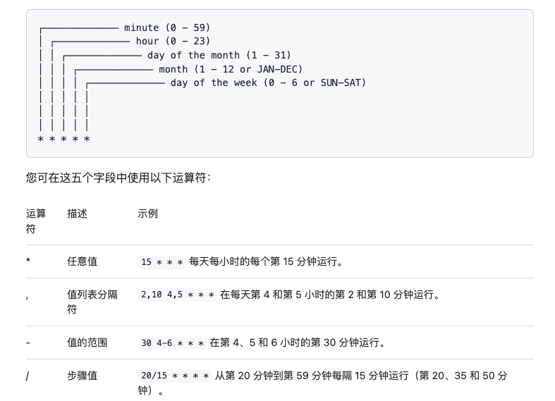

<div align="center">


<h1 align="center">


wechat-public-account-push


</h1>


[](https://github.com/wangxinleo/wechat-public-account-push/stargazers)
[](https://github.com/wangxinleo/wechat-public-account-push/network/members)
[](https://github.com/wangxinleo/wechat-public-account-push/issues)
[](https://github.com/wangxinleo/wechat-public-account-push/graphs/contributors)
[](https://github.com/wangxinleo/wechat-public-account-push/blob/master/LICENSE)


</div>

**wechat-public-account-push 是一个用于微信公众号/微信测试号给用户执行微信推送的脚本，改编自目前小红书/知乎突然火起来的【给女朋友的七夕浪漫，微信自动推送消息】，用Nodejs实现而成。**

**如果这个项目很有意思，帮忙右上角点个 star✨ 支持我们 ❤❤**

[>>> 点这里获取更新公告✨](https://github.com/wangxinleo/wechat-public-account-push/discussions/categories/announcements)

详细功能如下：

- **支持多个收件人设置成不同的测试号模板，专属定制更贴心**
- **推送每日天气**
- **支持农历生日提醒** 感谢 @ZzqiZQute
- **每日/明日/每周/每年星座运势** 感谢 @ZzqiZQute
- **文艺青年专属每日一句**
- **古诗古文** 感谢 @ZzqiZQute
- **彩虹屁** 感谢 @ZzqiZQute
- **朋友圈文案** 感谢 @ZzqiZQute
- **毒鸡汤** 感谢 @ZzqiZQute
- **根据配置就近推送前N个值得纪念的日子**
- **自定义出参，模板定制更个性**
- **推送回执**
- **不需要拥有服务器，白嫖actions执行，每天定时发送**
- **理论上支持所有远端的日志推送（目前仅支持测试号，没时间做）**

---
[目录]

<!-- TOC depthFrom:2 -->

- [1. 如何使用](#1-如何使用(以测试号为例))
    - [1.1. 第一步：注册一个微信公众测试号](#11-第一步：注册一个微信公众测试号)
    - [1.2. 第二步：进行模板配置](#12-第二步：进行模板配置)
    - [1.3. 第三步：完成配置文件，并运行 wechat-public-account-push](#13-第三步：完成配置文件，并运行wechat-public-account-push)
        - [1.3.1. 方式一：使用Github Action](#131-方式一：使用Github-Action)
        - [1.3.2. 方式二：下载程序包到本地或服务器运行](#132-方式二：下载程序包到本地或服务器运行)
- [2. 参数说明](#2-参数说明)
- [3. 模板样例](#3-模板样例)
- [4. action脚本说明](#4-action脚本说明)
- [5. 常见问题](#5-常见问题)
- [6. 版本发布及更新](#6-版本发布及更新)
- [7. 成为开源贡献成员](#7-成为开源贡献成员)
    - [7.1. 贡献代码](#71-贡献代码)
    - [7.2. 贡献文档](#72-贡献文档)
- [8. 致谢](#8-致谢)
- [9. wechat-public-account-push 答疑群](#9-wechat\-public\-account\-push答疑群)
- [10. 其他](#10-其他)
- [11. 叨叨两句](#11-叨叨两句)

<!-- /TOC -->


**Github 仓库地址：[wangxinleo/wechat-public-account-push](https://github.com/wangxinleo/wechat-public-account-push)**


**Github 镜像仓库地址（国内备用01）：[wangxinleo/wechat-public-account-push](https://hub.fastgit.xyz/wangxinleo/wechat-public-account-push)**


**Github 镜像仓库地址（国内备用02）：[wangxinleo/wechat-public-account-push](https://hub.njuu.cf/wangxinleo/wechat-public-account-push)**


**注意：**


- **本仓库开源的初衷是看不下去营销号用这么一个简单的脚本刻意在网络上肆意要求加群/关注微信公众号才能获取源码的行为**
- **本应用仅用于学习和测试，作者本人并不对其负责，请于运行测试完成后自行删除，请勿滥用！**
- **所有代码都是开源且透明的，任何人均可查看，程序不会保存或滥用任何用户的个人信息**
- **请仔细阅读配置文档，自己对自己的配置负责**


运行图示：


## 1. 如何使用(以测试号为例)


wechat-public-account-push 实现自消息推送的原理，是通过调用一系列开放的api实现的, 所以也非常适合初学者学习。


**要使用 wechat-public-account-push, 我们只需要做拥有自己的公众号, 得到相关配置信息进行配置即可**


### 1.1. 第一步：注册一个微信公众测试号

- 浏览器打开并登录 [微信公众测试号](https://mp.weixin.qq.com/debug/cgi-bin/sandbox?t=sandbox/login)

- 登录成功后, 就可以生成微信公众测试号的appID和appsecret这两串数字, 记下备用


- 扫描测试号二维码关注测试号, 扫描之后, 右边就会出现相应的已关注人员id, 记下备用


### 1.2. 第二步：进行模板配置


新增测试模板, 点击 `新增测试模板` , 进行以下设置


> 这里面的每一个{{***.DATA}}都对应相应的数据，需要就保留，不需要就删掉


> **更多模板** 请查看上方更新内容


模板标题: 自定义，例如: `亲爱的，早上好!`


模板内容:

```
{{date.DATA}}  
城市：{{city.DATA}}  
天气：{{weather.DATA}}  
最低气温: {{min_temperature.DATA}}  
最高气温: {{max_temperature.DATA}}  
今天是我们恋爱的第{{love_day.DATA}}天
今天是我们结婚的第{{marry_day.DATA}}天

{{birthday_message.DATA}}

{{one_talk.DATA}} -- {{talk_from.DATA}}

{{note_en.DATA}}  
{{note_ch.DATA}}
```

模板标题: `推送完成提醒`

模板内容:

```
服务器信息：{{post_time_zone.DATA}} {{post_time.DATA}}

共推送 {{need_post_num.DATA}}  人
成功: {{success_post_num.DATA}} | 失败: {{fail_post_num.DATA}}
成功用户: {{success_post_ids.DATA}}
失败用户: {{fail_post_ids.DATA}}
```


记下模板代码


### 1.3. 第三步：完成配置文件，并运行wechat-public-account-push

#### 1.3.1 方式一：使用Github-Action

👇👇👇👇点击展开

<details>

**1.3.1.1 fork仓库并修改相应配置**

- fork仓库


- 修改相应配置


- 按提示填入相应配置后保存


**1.3.1.2 在私人仓库中写入自己公众号的信息，启用workflow自动任务，定时执行**

- 按下图添加两项保密信息`APP_ID` 和 `APP_SECRET`, 可以从测试号后台拿到这两项信息

**这步一定要认真填写，不然程序无法运行！**


- 启用action脚本


**1.3.1.3 (选做)：检查脚本是否可以正常执行**

- 手动启动脚本


- 查看执行结果


</details>

<br/>

#### 1.3.2 方式二：下载程序包到本地或服务器运行
如果是 Nodejs 开发者，直接 Clone 源码，然后 VS 打开解决方案，配置 Cookie 后即可直接本地进行运行和调试。

对于不是开发者的朋友，可以通过以下命令到本地或任意服务器运行，步骤如下。

- Linux 系统

👇👇👇👇点击展开

<details>

Ⅰ. **安装运行环境**

- 如果本地已安装 `Nodejs` 和 `git` 环境,  请跳过这一步

如果您使用的是以  Debian 或 Ubuntu 为基础的 服务器系统

```shell

# Using Debian and Ubuntu based distributions
cd ~

curl -fsSL https://deb.nodesource.com/setup_16.x | sudo -E bash -

sudo apt-get install -y nodejs

sudo apt-get install git

```

如果您使用的是 centos 或 其他 服务器系统

```shell

# Using Enterprise Linux based distributions
cd ~

curl -fsSL https://rpm.nodesource.com/setup_16.x | sudo bash -

yum install git

```

Ⅱ. **下载项目**

```shell

cd ~

git clone https://github.com/wangxinleo/wechat-public-account-push.git

# 二选一：中国内地执行这一步，速度更快
npm install -g cnpm --registry=https://registry.npm.taobao.org

cnpm install

# 二选一：国外服务器执行这一步
npm install

```

Ⅲ. **填写配置**

不会使用vim 命令的可以使用其他命令，或用图形化界面进行修改。

这是你的服务器，只要能改掉文件里的配置就可以了。

```shell

vim ~/wechat-public-account-push/config/index.js

```

Ⅳ. **运行**

```shell

node ~/wechat-public-account-push/main.js

```

</details>

<br/>

- Windows 系统

👇👇👇👇点击展开

<details>

Ⅰ. **安装运行环境**

- 如果本地已安装 `Nodejs` 和 `git` 环境,  请跳过这一步

[下载Nodejs16.x安装包](https://nodejs.org/dist/v16.17.0/node-v16.17.0-x64.msi)

[下载git安装包](https://github.com/git-for-windows/git/releases/download/v2.37.3.windows.1/Git-2.37.3-64-bit.exe)

安装说明：**无它，一路next**

Ⅱ. **下载项目**

在你的电脑里随便一个盘选择任意一个文件夹（最好自己创建，自己要知道在哪里），右键 --> git base

执行以下命令

```shell

git clone https://github.com/wangxinleo/wechat-public-account-push.git

# 二选一：中国内地执行这一步，速度更快
npm install -g cnpm --registry=https://registry.npm.taobao.org

cnpm install

# 二选一：国外服务器执行这一步
npm install

```

Ⅲ. **填写配置**

如果上一步执行成功了，你当前文件夹里面肯定会出现 `wechat-public-account-push` 文件夹

到 `wechat-public-account-push/config/index.js` 中修改配置。 

如果显示无法打开，选中该文件 --> 右键 --> 打开方式 --> 记事本

按照提示修改配置

Ⅳ. **运行**

在 `wechat-public-account-push` 文件夹中，右键 --> git base

执行以下命令

```shell

node ./main.js

```

</details>

<br/>

## 2. 参数说明
这里的**参数**是指能够被微信测试号模板接收的参数集合。启动后会根据我们的配置信息，组成相应的参数，如：

```
{
    one_talk: { value: '没有绝对的废物，只有放错位置的资源。', color: '#1e90fa' },
    talk_from: { value: '上海市垃圾分类', color: '#5c23ca' },
    earthy_love_words: { value: '看着你，我喝白开水都会醉。', color: '#daae5e' },
    love_day: { value: 2682, color: '#f0b4ee' },
    marry_day: { value: 973, color: '#fcde54' },
    ex_day: { value: 3, color: '#703316' },
    encourage_oneself: { value: '你主要的问题在于读书太少而想得太多', color: '#4b84d2' },
    lover_prattle: { value: '因为太喜欢你，所以看谁都像是情敌。', color: '#6f6041' }
}
```

程序启动后，会生成以上json格式的参数集合。

**所以微信测试号模板的那些 {{xxx.DATA}} 从哪儿来，就是从这里来的！！！！**

**所以微信测试号模板的那些 {{xxx.DATA}} 从哪儿来，就是从这里来的！！！！**

**所以微信测试号模板的那些 {{xxx.DATA}} 从哪儿来，就是从这里来的！！！！**

划分的依据主要是根据功能需求和个人配置，通过获取到这些参数由测试号进行组装推送模板。

目前可被推送模板获取的字段如下：
> \* 为新增的可配置参数

> ~~删除线~~ 为已废除的参数

**基础类**

| 参数                     | 详细             | 示例             |
|------------------------|----------------|----------------|
| \* to_name.DATA        | 收件人姓名          | 老婆3            |
| date.DATA              | YYYY-MM-DD 星期d | 2022-08-26 星期五 |
| \* province.DATA       | 省份             |  广东            |
| city.DATA              | 城市             |  惠州            |


**天气类**

| 参数                     | 详细             | 示例             |
|------------------------|----------------|----------------|
| weather.DATA           | 天气             | 阵雨转多云          |
| min_temperature.DATA   | 最低气温           | 25℃            |
| max_temperature.DATA   | 最高气温           | 25℃            |
| \* wind_direction.DATA | 风向             | 持续东南风          |
| \* wind_scale.DATA     | 风级             | <3级            |

**每日N句**

| 参数                                      | 详细        | 示例                                                    |
|-----------------------------------------|-----------|-------------------------------------------------------|
| note_en.DATA                            | 金山每日一句-英文 | Nothing in this world that's worth having comes easy. |
| note_ch.DATA                            | 金山每日一句-中文 | 这世界上凡是值得拥有的东西，都不易获得。                                  |
| \* one_talk.DATA                        | 每日一言-内容   | 愿你遍布祖国山河，觉得人生也值得                                      |
| \* talk_from.DATA                       | 每日一言-来源   | 晓良                                                    |
| \* earthy_love_words.DATA               | 土味情话(彩虹屁) | 我今晚会很忙，忙着跟你过日子                                        |
| \* moment_copyrighting.DATA             | 朋友圈文案     | 错过太阳就不要再错过月亮了                                         |
| \* poison_chicken_soup.DATA             | 毒鸡汤       | 我从不以强凌弱，我欺负他之前，真不晓得他比我弱。                              |
| \* poetry_content.DATA                  | 古诗古文-内容   | 举头望明月，低头思故乡。                                          |
| \* poetry_title.DATA                    | 古诗古文-标题   | 静夜思                                                   |
| \* poetry_author.DATA                   | 古诗古文-作者   | 李白                                                    |
| \* poetry_dynasty.DATA                  | 古诗古文-朝代   | 唐代                                                    |

**星座运势**

| 参数                    | 详细                        | 示例                          |
|-----------------------|---------------------------|-----------------------------|
| comprehensive_horoscope.DATA    | 综合运势 | 太多了，不示例了，自己调用查看效果 |
| love_horoscope.DATA    | 爱情运势 |  太多了，不示例了，自己调用查看效果   |
| career_horoscope.DATA | 事业学业             |  太多了，不示例了，自己调用查看效果  |
| wealth_horoscope.DATA | 财富运势             |  太多了，不示例了，自己调用查看效果  |
| healthy_horoscope.DATA | 健康运势            |  太多了，不示例了，自己调用查看效果  |


**计时类**

| 参数                    | 详细                        | 示例                          |
|-----------------------|---------------------------|-----------------------------|
| ~~love_day.DATA~~     | 已预置, 但是可以删掉, 在配置中自定义, 见下文 | 2674                        |
| ~~marry_day.DATA~~    | 已预置, 但是可以删掉, 在配置中自定义, 见下文 | 965                         |
| birthday_message.DATA | 生日消息和节日消息                 | 距离 宝贝 的生日还有122天，距离 中秋节还有30天 |

**自定义计时及自定义文本插槽**

现在你可以自己加入更多需要铭记的日子，来丰富你的推送模板了！

比如:

```
光荣的退伍军人，您好！
今天是您退伍的第{{ex_day.DATA}}天

您守护的不只是山河社稷，更是每个年轻人的未来！
```

这个 `ex_day.DATA` 在上面的出参表并没有定义啊，怎么设置它呢? 

现在在配置文件中就可以进行设置了！


但是有以下情况需要注意，不要占用表中已有的关键字，会发生不可预料的状况噢！


**推送回执(特有, 仅在其他模板发送完成后才能获取)**


| 参数                       | 详细        | 示例                  |
|--------------------------|-----------|---------------------|
| \* post_time_zone.DATA   | 服务器时区     | Asia/Shanghai       |
| \* post_time.DATA        | 服务器执行脚本时间 | 2022-08-31 19:41:57 |
| \* need_post_num.DATA    | 共需推送N人    | 4                   |
| \* success_post_num.DATA | 成功推送N人    | 1                   |
| \* fail_post_num.DATA    | 推送失败N人    | 3                   |
| \* success_post_ids.DATA | 推送成功的用户   | 老婆0                 |
| \* fail_post_ids.DATA    | 推送失败的用户   | 老婆1,老婆2,老婆3         |


## 3.模板样例

**亲爱的, 早上好**

```
{{date.DATA}}  
城市：{{city.DATA}}  
天气：{{weather.DATA}}  
最低气温: {{min_temperature.DATA}}  
最高气温: {{max_temperature.DATA}}  
今天是我们恋爱的第{{love_day.DATA}}天
今天是我们结婚的第{{marry_day.DATA}}天

{{birthday_message.DATA}}

{{one_talk.DATA}} -- {{talk_from.DATA}}

{{note_en.DATA}}  
{{note_ch.DATA}}
```


**推送完成提醒**

```
服务器信息：{{post_time_zone.DATA}} {{post_time.DATA}}

共推送 {{need_post_num.DATA}}  人
成功: {{success_post_num.DATA}} | 失败: {{fail_post_num.DATA}}
成功用户: {{success_post_ids.DATA}}
失败用户: {{fail_post_ids.DATA}}
```

## 4. action脚本说明
这里的脚本使用的是 github 的 workflow 定时任务, 具体脚本文件放置在:


```
wechat-public-account-push/.github/workflows/weixin-push-on-time.yml
```


这里简单说明一下如何更改自动执行时间


目前脚本默认执行时间为 **每天的 北京时间上午 10:10**

如果想要变更脚本定时任务执行时间,可以更改以下代码段


```
on:
  workflow_dispatch:
  schedule:
    # 每天国际时间2:10 运行, 即北京时间 10:10 运行
    - cron: '10 2 * * *'
```


**推荐设置: `10 2 * * *` 或 `10 22 * * *` 等冷门时间，拥堵率低**


**定时任务注意尽量避免设置在 `utc 0:00, XX:00` 这类高拥堵时段。**


**定时任务注意尽量避免设置在 `utc 0:00, XX:00` 这类高拥堵时段。**


**定时任务注意尽量避免设置在 `utc 0:00, XX:00` 这类高拥堵时段。**




## 5. 常见问题

[关于获取accessToken:请求失败invalid appsecret rid xxxxx](https://github.com/wangxinleo/wechat-public-account-push/discussions/68)


[关于推送失败，报40001- 4000X](https://github.com/wangxinleo/wechat-public-account-push/discussions/39)


[关于目前仅支持测试号的问题](https://github.com/wangxinleo/wechat-public-account-push/discussions/23)


[关于定时任务好像没有自动执行（?）](https://github.com/wangxinleo/wechat-public-account-push/discussions/20)


[Issues（议题）](https://github.com/wangxinleo/wechat-public-account-push/issues)板块可以用来提交**Bug**和**建议**；

[Discussions（讨论）](https://github.com/wangxinleo/wechat-public-account-push/discussions)板块可以用来**提问**和**讨论**。

所以如果你有疑问，

* 请先确认是否可以通过升级到最新版本解决
* 然后搜索文档（特别是配置说明文档和常见问题文档）查看是否已有解决方案


如果确认还未解决，可以自己提交 Issue，我会尽快确认并解决。


## 6. 版本发布及更新

关于新版本发布后，如何同步最新的内容到自己 Fork 的仓库

### 6.1 重新fork

**删掉后重新Fork会导致之前配置过的GitHub Secrets和提交的代码更改全部丢掉，只能重新部署。**
### 6.2 pull request（这个方法太多人不会用了, 删除）

### 6.3 GitHub Fetch Upstream Branch

- 在自己的项目仓库中选择 "Sync fork"

- 点击 "Update branch" 完成


可能会遇到 **因为冲突需要你们删除你们已经更改的记录**

如果只是纯粹更改配置，放心大胆的点删除, 然后更新最新代码仓库就好了。

如果**你更改了源代码进行了部分定制**, 请注意备份代码段。

### 6.4 actions 脚本自动

**以后会考虑加入actions 脚本每周自动更新fork仓库，但是目前精力不足，只能采用上述保守方案**

建议每个人先看看更新的内容是否是自己需要的再进行更新。

也建议把右上角的 Star 点一下，这样有重要更新时就会有邮件推送了。


## 7. 成为开源贡献成员

### 7.1 贡献代码


如果你有好的想法，欢迎向仓库贡献你的代码，贡献步骤：


* 搜索查看 Issue，确定是否已有人提过同类问题或者有新的想法


* 确认没有同类 Issue 后，自己可新建 Issue，描述问题或建议


* 如果想自己解决，请 Fork 仓库后，在**develop 分支**进行编码开发，完成后**提交 PR 到 develop 分支**，并标注解决的 Issue 编号


我会尽快进行代码审核，测试成功后会合并入 main 主分支，提前感谢您的贡献。


### 7.2 贡献文档
文档部分由于我个人精力有限（写文档比写代码累多了），所以有些地方写的很简略，甚至有遗漏和错别字，不能贡献代码的朋友也欢迎来一起维护文档，欢迎 PR 来纠正我，一样都算是对开源做贡献了。


## 8. 致谢

### 贡献/参与者

@LordonCN Lordon

@ZzqiZQute zz

感谢那些默默支持我, 鼓励我继续更新这个小玩具的朋友。

感谢所有参与到开发/测试中的朋友们，是大家的帮助让 TA 越来越好！ (*´▽｀)ノノ

## 9. wechat-public-account-push答疑群

不管文档写得多详细，还是会有人不会呐！还是建个群答疑吧! 

群我隐藏在文档里了哼哼，不仔细看文档可找不到加群的地方哦！

2022-09-10 算啦还是不隐藏了，你们来尽情问吧。


<a target="_blank" href="https://qm.qq.com/cgi-bin/qm/qr?k=y0plwm9zhOI35EwlOdRh372g4KWbqMSt&jump_from=webapi"></a>

## 10. 其他

时区查询: [https://www.zeitverschiebung.net/cn/all-time-zones.html](https://www.zeitverschiebung.net/cn/all-time-zones.html)

## 11. 叨叨两句

**这个仓库只能算是重复实现一下别人的想法, 主要是了解到了这个想法却一直找不到原作者的源码很是苦恼, 结果还遇到了要求加关注的情况**

**真的非常不喜欢目前国内论坛/某乎/某书/某字母站的博主在分享一些有趣的项目后,甚至是分享了教程之后却不提供源码链接,要求关注公众号或QQ群才进行分享**

**虽然我无权谴责这些流量变现的做法, 但是我认为作者既然开源自己的作品, 那就是希望其他人能一起体会coding的喜悦, 请部分博主尊重作者意愿, 尊重开源协议**


