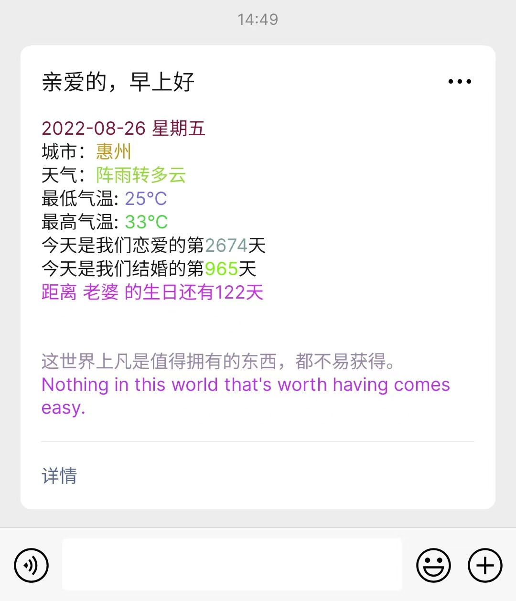
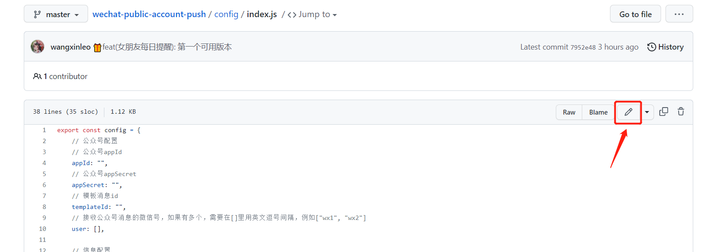
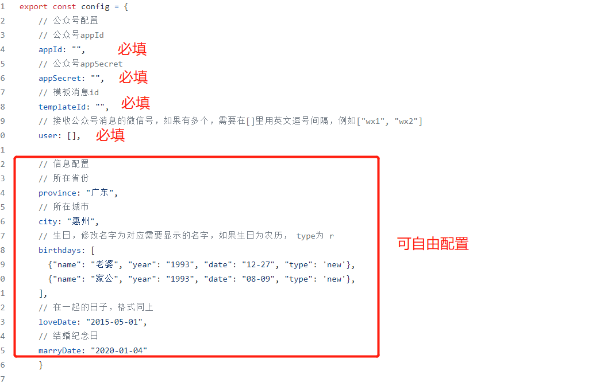
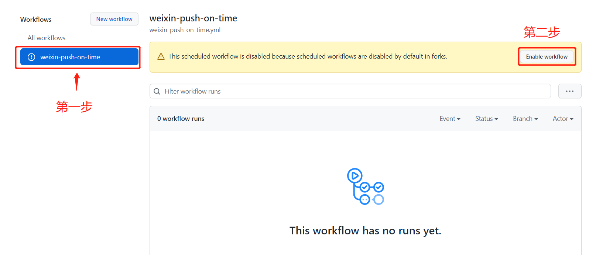
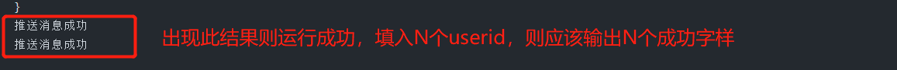
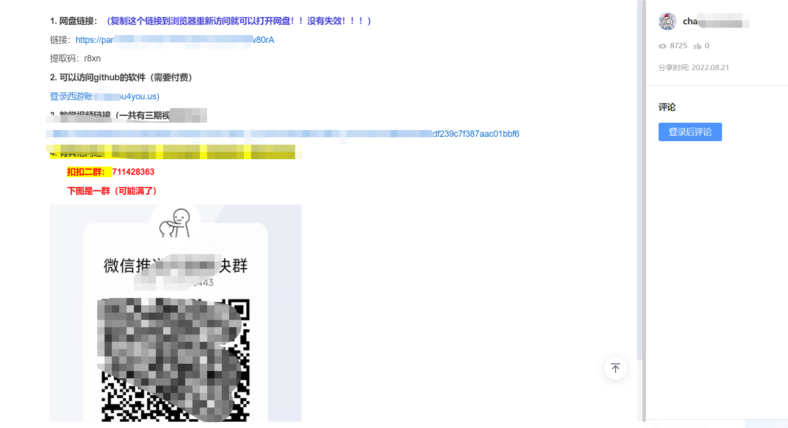
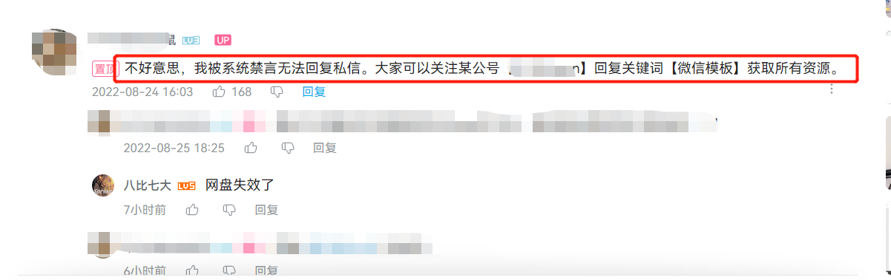

<div align="center">

<h1 align="center">

wechat-public-account-push

</h1>

[](https://github.com/wangxinleo/wechat-public-account-push/stargazers)
[](https://github.com/wangxinleo/wechat-public-account-push/network)
[](https://github.com/wangxinleo/wechat-public-account-push/issues)
[](https://github.com/wangxinleo/wechat-public-account-push/graphs/contributors)
[](https://github.com/wangxinleo/wechat-public-account-push/blob/main/LICENSE)

</div>

**wechat-public-account-push 是一个用于微信公众号/微信测试号给用户执行微信推送的脚本，改编自目前小红书/知乎突然火起来的【给女朋友的七夕浪漫，微信自动推送消息】，用Nodejs实现而成。**

目前可被推送模板获取的字段如下：

| 参数 | 详细 | 示例 |
|-----|-----|-----|
|date.DATA | YYYY-MM-DD 星期d | 2022-08-26 星期五 |
|city.DATA | 城市 |  惠州 |
|weather.DATA | 天气 | 阵雨转多云 |
|min_temperature.DATA | 最低气温 | 25℃ |
|max_temperature.DATA | 最高气温 | 25℃ |
|love_day.DATA | 在一起N天 | 2674 |
|marry_day.DATA | 结婚N天 | 965 |
|birthday_message | 生日消息 | 距离 宝贝 的生日还有122天 |
|note_en.DATA | 金山每日一句英文 | Nothing in this world that's worth having comes easy. |
|note_ch.DATA | 金山每日一句中文 | 这世界上凡是值得拥有的东西，都不易获得。 |


**Github 仓库地址：[wangxinleo/wechat-public-account-push](https://github.com/wangxinleo/wechat-public-account-push)**

**注意：**

- **本仓库开源的初衷是看不下去营销号用这么一个简单的脚本刻意在网络上肆意要求加群/关注微信公众号才能获取源码的行为**
- **本应用仅用于学习和测试，作者本人并不对其负责，请于运行测试完成后自行删除，请勿滥用！**
- **所有代码都是开源且透明的，任何人均可查看，程序不会保存或滥用任何用户的个人信息**
- **请仔细阅读配置文档，自己对自己的配置负责**

运行图示：



## 1. 如何使用(以测试号为例)

wechat-public-account-push 实现自消息推送的原理，是通过调用一系列开放的api实现的, 所以也非常适合初学者学习。

**要使用 wechat-public-account-push, 我们只需要做拥有自己的公众号, 得到相关配置信息进行配置即可**

### 1.1. 第一步：注册一个微信公众号

- 浏览器打开并登录 [微信公众测试号](https://mp.weixin.qq.com/debug/cgi-bin/sandbox?t=sandbox/login)
- 登录成功后, 就可以生成微信公众测试号的appID和appsecret这两串数字, 记下备用


- 扫描测试号二维码关注测试号, 扫描之后, 右边就会出现相应的已关注人员id, 记下备用


### 1.2. 第二步：进行模板配置

新增测试模板, 点击 `新增测试模板` , 进行以下设置

> 这里面的每一个{{***.DATA}}都对应相应的数据，需要就保留，不需要就删掉

模板标题: 自定义，例如: `亲爱的，早上好!`

模板内容:

```
{{date.DATA}}  
城市：{{city.DATA}}  
天气：{{weather.DATA}}  
最低气温: {{min_temperature.DATA}}  
最高气温: {{max_temperature.DATA}}  
今天是我们恋爱的第{{love_day.DATA}}天
今天是我们结婚的第{{marry_day.DATA}}天
{{birthday_message.DATA}}

{{note_en.DATA}}  
{{note_ch.DATA}}
```

记下模板代码


### 1.3. 第三步：fork仓库, 填入相应配置
- fork仓库

    

- 修改相应配置

    

    

    

- 按需填入相应配置后保存

    

    

    

### 1.4. 第四步：启用workflow自动任务,定时执行
- 启用action脚本

    

    

    

### 1.5. 第五步(选做): 检查脚本是否可以正常执行
- 手动启动脚本
    

- 查看执行结果
    

    

    

## 2. action脚本说明
这里的脚本使用的是 github 的 workflow 定时任务, 具体脚本文件放置在:

```
wechat-public-account-push/.github/workflows/weixin-push-on-time.yml
```

这里简单说明一下如何更改自动执行时间

目前脚本默认执行时间为 **每天的 北京时间上午 8:00**

如果想要变更脚本定时任务执行时间,可以更改以下代码段

```
on:
  workflow_dispatch:
  schedule:
    # 每天国际时间4:00 运行, 即北京时间 12:00 运行
    - cron: '0 4 * * *'
```

## 3. 常见问题

[Issues（议题）](https://github.com/wangxinleo/wechat-public-account-push/issues)板块可以用来提交**Bug**和**建议**；

所以如果你有疑问，

* 请先确认是否可以通过升级到最新版本解决
* 然后搜索文档（特别是配置说明文档和常见问题文档）查看是否已有解决方案

如果确认还未解决，可以自己提交 Issue，我会尽快确认并解决。

## 4. 成为开源贡献成员

如果你有好的想法，欢迎向仓库贡献你的代码，贡献步骤：

* 搜索查看 Issue，确定是否已有人提过同类问题或者有新的想法

* 确认没有同类 Issue 后，自己可新建 Issue，描述问题或建议

* 如果想自己解决，请 Fork 仓库后，在**develop 分支**进行编码开发，完成后**提交 PR 到 develop 分支**，并标注解决的 Issue 编号

我会尽快进行代码审核，测试成功后会合并入 main 主分支，提前感谢您的贡献。

## 5. 其他

**真的非常不喜欢目前国内论坛/某乎/某书/某字母站的博主在分享一些有趣的项目后,甚至是分享了教程之后却不提供源码链接,要求关注公众号或QQ群才进行分享**

**虽然我无权谴责这些流量变现的做法, 但是我认为作者既然开源自己的作品, 那就是希望其他人能一起体会coding的喜悦, 请部分博主尊重作者意愿, 尊重开源协议**



