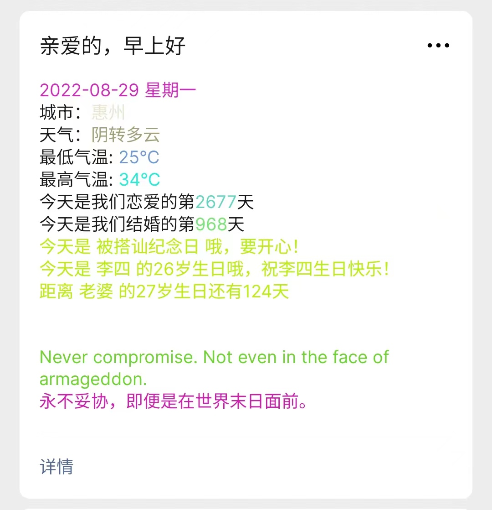
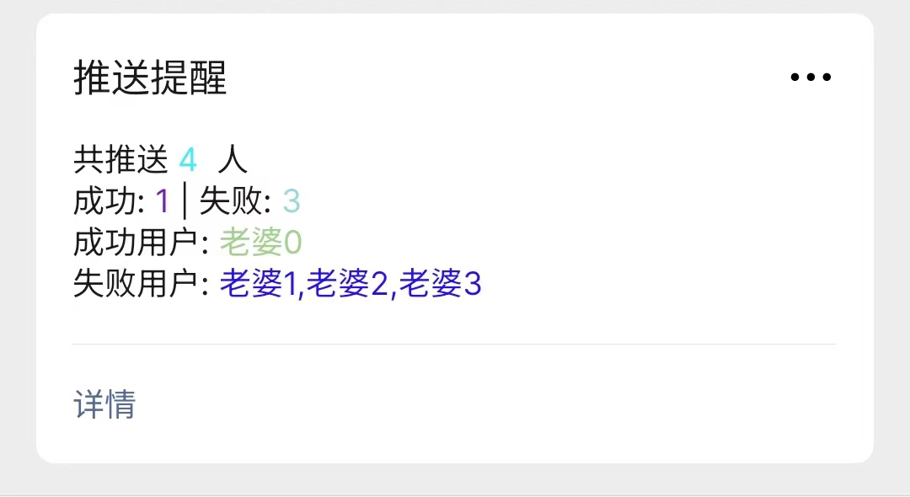
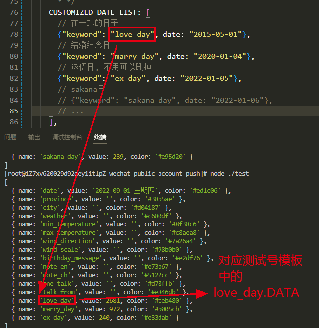
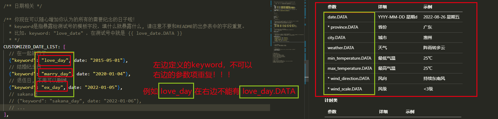
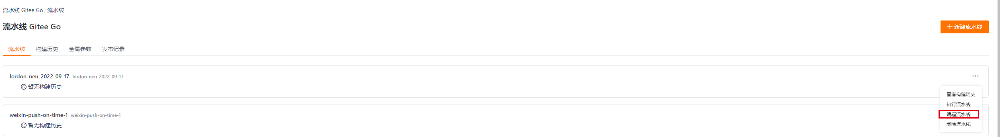
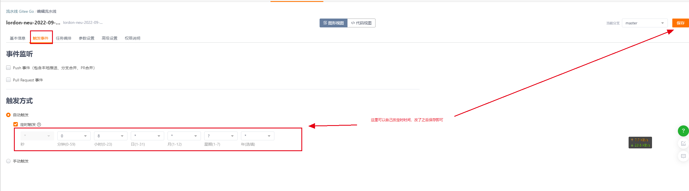

<div align="center">


<h1 align="center">


wechat-public-account-push


</h1>


[](https://github.com/wangxinleo/wechat-public-account-push/stargazers)
[](https://github.com/wangxinleo/wechat-public-account-push/network/members)
[](https://github.com/wangxinleo/wechat-public-account-push/issues)
[](https://github.com/wangxinleo/wechat-public-account-push/graphs/contributors)
[](https://github.com/wangxinleo/wechat-public-account-push/blob/master/LICENSE)


</div>

**wechat-public-account-push
是一个用于微信公众号/微信测试号给用户执行微信推送的脚本，改编自目前小红书/知乎突然火起来的【给女朋友的七夕浪漫，微信自动推送消息】，用Nodejs实现而成。**

**如果这个项目很有意思，帮忙右上角点个 star✨ 支持我们 ❤❤**

**如果有任何需要帮助可以联系wangxin.leo@outlook.com ❤❤**

[>>> 点这里获取更新公告✨](https://github.com/wangxinleo/wechat-public-account-push/discussions/categories/announcements)

<h3 style="color: red;">重要通知：</h3>

**微信团队于2023-05-04日晚12点下线【自定义颜色】、【emoji表情符号】、【自定义换行】、【尾部/备注字段】。**

**【微信测试号】的推送服务已受到影响，原有的推送模板需要用户自行修改，详见 [如何修复因2023-05-04微信推送服务规范整改，导致推送服务异常](https://github.com/wangxinleo/wechat-public-account-push/issues/326)**

**使用服务号推送不受影响**

---

详细功能如下：

- **支持多个收件人设置成不同的测试号模板，专属定制更贴心**
- **推送每日天气**
- **各类文案集锦**
- **支持农历生日提醒**
- **每日/明日/每周/每年星座运势**
- **大学生课程表**
- **前N个值得纪念的日子**
- **推送回执**
- **自定义出参，模板定制更个性**
- **网页自动生成配置插件**
- **支持gitee go / github actions 不需要拥有服务器，白嫖actions执行，每天定时发送**
- **支持本地化部署每天定时发送**
- **支持多推送渠道**

---
[目录]

<!-- TOC depthFrom:2 -->

- [1. 如何使用](#1-如何使用)
  - [1.1. 第一步：选用一个合适的消息通道](#11-第一步选用一个合适的消息通道)
  - [1.2. 第二步：完成配置文件，并运行wechat-public-account-push](#12-第二步完成配置文件并运行wechat-public-account-push)
    - [1.2.1 方式一：使用网页工具自动生成Github-Action配置(不准时，排队执行，胜在免费)](#121-方式一使用网页工具自动生成github-action配置不准时排队执行胜在免费)
    - [1.2.2 方式二：使用Github-Action(不准时，排队执行，胜在免费)](#122-方式二使用github-action不准时排队执行胜在免费)
    - [1.2.3 方式三：使用Gitee-go(定时任务收费，前200分钟免费，非常准时)](#123-方式三使用gitee-go定时任务收费前200分钟免费非常准时)
    - [1.2.4 方式四：下载程序包到本地或服务器运行(需要有自己的服务器，使用系统的定时任务非常准时)](#124-方式四下载程序包到本地或服务器运行需要有自己的服务器使用系统的定时任务非常准时)
    - [1.2.5 方式五：使用云函数运行（需要使用运营商提供的 __付费__ 云函数功能，非常准时)](#125-方式五使用云函数运行需要使用运营商提供的-付费-云函数功能非常准时)
- [2. 公众号模板参数说明](#2-公众号模板参数说明)
- [3. config参数说明](#3-config参数说明)
- [4. template-config推送模板参数说明](#4-template-config推送模板参数说明)
- [5. 常用的推送模板样例](#5-常用的推送模板样例)
- [6. GitHub/Gitee 如何更改自动执行时间](#6-githubgitee-如何更改自动执行时间)
  - [6.1 github action如何更改自动执行时间](#61-github-action如何更改自动执行时间)
  - [6.2 gitee go如何更改自动执行时间](#62-gitee-go如何更改自动执行时间)
- [7. 常见问题](#7-常见问题)
- [8. 版本发布及更新](#8-版本发布及更新)
  - [8.1 重新fork](#81-重新fork)
  - [8.2 GitHub Fetch Upstream Branch](#82-github-fetch-upstream-branch)
  - [8.3 actions 脚本自动](#83-actions-脚本自动)
- [9. 成为开源贡献成员](#9-成为开源贡献成员)
  - [9.1 贡献代码](#91-贡献代码)
  - [9.2 贡献文档](#92-贡献文档)
- [10. 致谢](#10-致谢)
  - [贡献/参与者](#贡献参与者)
- [11. wechat-public-account-push答疑群](#11-wechat-public-account-push答疑群)
- [12. 其他](#12-其他)

<!-- /TOC -->


**Github 仓库地址：[wangxinleo/wechat-public-account-push](https://github.com/wangxinleo/wechat-public-account-push)**

~~**Github
镜像仓库地址（国内备用01）：[wangxinleo/wechat-public-account-push](https://hub.fastgit.xyz/wangxinleo/wechat-public-account-push)**~~

~~**Github
镜像仓库地址（国内备用02）：[wangxinleo/wechat-public-account-push](https://hub.njuu.cf/wangxinleo/wechat-public-account-push)**~~

**Gitee
国内仓库地址：[wangxinleo/wechat-public-account-push](https://gitee.com/wangxin_leo/wechat-public-account-push)**

**注意：**

- **本仓库开源的初衷是看不下去营销号用这么一个简单的脚本刻意在网络上肆意要求加群/关注微信公众号才能获取源码的行为**
- **本应用仅用于学习和测试，作者本人并不对其负责，请于运行测试完成后自行删除，请勿滥用！**
- **所有代码都是开源且透明的，任何人均可查看，程序不会保存或滥用任何用户的个人信息**
- **请仔细阅读配置文档，自己对自己的配置负责**

运行图示：




### 新手教学[⭐点击开始学习](./docs/novice-teaching/novice.md)
## 1. 如何使用

wechat-public-account-push 实现自消息推送的原理，是通过调用一系列开放的api实现的, 所以也非常适合初学者学习。

**要使用 wechat-public-account-push, 我们只需要选择合适的消息通道, 得到相关配置信息进行配置即可**

### 1.1. 第一步：选用一个合适的消息通道

您可以在以下消息通道中选择一适合自己的消息通道

**推荐通道**

> iOS 可以无后台推送，推荐使用
> 
> 2022年9月22日 Android 无法正常推送，MiPush 把 pushdeer 应用的推送权限暂停。原因是要求pushDeer审核推送内容。

[⭐PushDeer  >>> 点击使用](./docs/message-channel/push-deer.md)


**其他通道**

> 免费版每个接收用户每天允许推送200条消息，付费版每个接收用户每天1000条
> 
> 1分钟内接收5次请求，超出的请求将不再推送。另外对于相同的内容，1小时内限制发送3条。
>
> 消息推送时显示的是 **设备通知**，标题需要**进入公众号查看**
>
> 消息放置在消息列表，方便随时查看
>
> 不再是xxxx测试号，而是推送加服务号，更美观
>
> 此通道[可能会被腾讯弃用](https://developers.weixin.qq.com/community/minihome/doc/000a46c7eb8468ba1a1cc863e51401)，请评估风险后再选择
>

[⭐pushplus推送加服务号 >>> 点击使用](./docs/message-channel/push-plus.md)

> 免费版每个接收用户每天允许推送5条消息，付费版每个接收用户每天1000条
>
> 消息推送时显示的是 **设备通知**，标题需要**进入公众号查看**
> 
> 消息放置在消息列表，方便随时查看
>
> 不再是xxxx测试号，而是方糖服务号，更美观
>
> 此通道[可能会被腾讯弃用](https://developers.weixin.qq.com/community/minihome/doc/000a46c7eb8468ba1a1cc863e51401)，请评估风险后再选择
>

[⭐server酱服务号 >>> 点击使用](./docs/message-channel/server-chan.md)

> 测试号的标题**不能**修改为自定义的名称，**不能**修改测试号的头像
> 
> 推送的消息必须要点进订阅号才能收到
> 
> 每次要修改内容必须要自定义模版
> 
> 此通道[可能会被腾讯弃用](https://developers.weixin.qq.com/community/minihome/doc/000a46c7eb8468ba1a1cc863e51401)，请评估风险后再选择

[⭐微信测试号 >>> 点击使用](./docs/message-channel/test-number.md)

> 2022年6月20日后创建的应用需要填写可信IP，且可信IP不可公用，因此新应用无法按此配置通道
> 
> 2022年9月23日后可信IP无法直接填写，需要验证企业域名才允许使用，意味着此方式将不再向个人提供服务

~~⭐企业微信应用消息 >>>~~(已删除)


### 1.2. 第二步：完成配置文件，并运行wechat-public-account-push

#### 1.2.1 方式一：（可能仅支持微信测试号）使用网页工具自动生成Github-Action配置(不准时，排队执行，胜在免费)

> 以下为@shuangxunian ShuangxuNian大佬 提供的网页配置插件
>
> 使用时请详细参考其提供的具体文档
>
> 感谢 ShuangxuNian大佬 的贡献

[✨配置自动生成 传送门 >>>](https://shuangxunian.github.io/wechat-form/)

[❓配置自动生成 教程 >>>](https://github.com/shuangxunian/wechat-form)

[❓配置完成后如何手动运行或者更改自动运行时间? 点开链接查看4. 5. >>>](./docs/how-to-use/github-actions.md)

#### 1.2.2 方式二：使用Github-Action(不准时，排队执行，胜在免费)
> 世界上最大的同性交友平台(不是)，需要一定的英语基础，**编辑的时候请不要使用网页的自动翻译**

[❓Github-Action部署教程 >>>](./docs/how-to-use/github-actions.md)

#### 1.2.3 方式三：使用Gitee-go(定时任务收费，前200分钟免费，非常准时)
> 国产代码仓库，和github逻辑基本一致。全中文，对萌新友好。

[❓Gitee-Go部署教程 >>>](./docs/how-to-use/gitee-go.md)

#### 1.2.4 方式四：下载程序包到本地或服务器运行(需要有自己的服务器，使用系统的定时任务非常准时)
> 如果是 Nodejs 开发者，直接 Clone 源码，然后 VS 打开后即可直接本地进行运行和调试。
>
> 对于不是开发者的朋友，可以通过以下教程到本地或任意服务器运行

[❓本地或在线服务器部署教程 >>>](./docs/how-to-use/run-in-server.md)


#### 1.2.5 方式五：使用云函数运行（需要使用运营商提供的 __付费__ 云函数功能，非常准时)
>由 @ZzqiZQute zz 大佬提供代码迁移及教程编辑

[❓云函数部署教程 >>>](./docs/how-to-use/cloud-function.md)

## 2. 公众号模板参数说明

以下参数可以被微信公众号的模板消息`{{xxx.DATA}}`捕获，用来自定义小伙伴们需要的信息。

目前可被推送模板获取的字段如下：

> ~~删除线~~ 为已废除的参数

**基础类**

| 参数                     | 详细             | 示例           |
|------------------------|----------------|--------------|
| to_name.DATA        | 收件人姓名          | 老婆3          |
| date.DATA              | YYYY-MM-DD 星期d | 2022-08-26 星期五 |
| province.DATA       | 省份             | 广东           |
| city.DATA              | 城市             | 惠州           |

**天气类**

| 参数                   | 详细     | 示例                                 |
|----------------------|--------|------------------------------------|
| weather.DATA         | 天气     | 阵雨转多云                              |
| min_temperature.DATA | 最低气温   | 25℃                                |
| max_temperature.DATA | 最高气温   | 25℃                                |
| wind_direction.DATA  | 风向     | 持续东南风                              |
| wind_scale.DATA      | 风级     | <3级                                |
| shidu.DATA           | 湿度     | 50%                                |
| pm25.DATA            | PM2.5  | 36                                 |
| pm10.DATA            | PM1.0  | 54                                 |
| sunrise.DATA         | 日出时间   | 06:20                              |
| sunset.DATA          | 日落时间   | 06:20                              |
| aqi.DATA             | 空气质量指数 | 40                                 |
| ganmao.DATA          | 预防感冒提醒 | 儿童、老年人及心脏、呼吸系统疾病患者人群应减少长时间或高强度户外锻炼 |
| notice.DATA          | 天气温馨语  | 雨虽小，注意保暖别感冒                        |

**节假日**
| 参数 | 详细 | 示例 |
|------------------------|----------------|----------------|
| holidaytts.DATA | 下一休息日综合提醒 | 还有3天就周六了，好好工作吧！距离国庆还有18天，早着呢 |

**每日N句**

| 参数                       | 详细        | 示例                                                    |
|--------------------------|-----------|-------------------------------------------------------|
| note_en.DATA             | 金山每日一句-英文 | Nothing in this world that's worth having comes easy. |
| note_ch.DATA             | 金山每日一句-中文 | 这世界上凡是值得拥有的东西，都不易获得。                                  |
| one_talk.DATA            | 每日一言-内容   | 愿你遍布祖国山河，觉得人生也值得                                      |
| talk_from.DATA           | 每日一言-来源   | 晓良                                                    |
| earthy_love_words.DATA   | 土味情话(彩虹屁) | 我今晚会很忙，忙着跟你过日子                                        |
| moment_copyrighting.DATA | 朋友圈文案     | 错过太阳就不要再错过月亮了                                         |
| poison_chicken_soup.DATA | 毒鸡汤       | 我从不以强凌弱，我欺负他之前，真不晓得他比我弱。                              |
| poetry_content.DATA      | 古诗古文-内容   | 举头望明月，低头思故乡。                                          |
| poetry_title.DATA        | 古诗古文-标题   | 静夜思                                                   |
| poetry_author.DATA       | 古诗古文-作者   | 李白                                                    |
| poetry_dynasty.DATA      | 古诗古文-朝代   | 唐代                                                    |

**星座运势**

| 参数                           | 详细   | 示例                |
|------------------------------|------|-------------------|
| comprehensive_horoscope.DATA | 综合运势 | 太多了，不示例了，自己调用查看效果 |
| love_horoscope.DATA          | 爱情运势 | 太多了，不示例了，自己调用查看效果 |
| career_horoscope.DATA        | 事业学业 | 太多了，不示例了，自己调用查看效果 |
| wealth_horoscope.DATA        | 财富运势 | 太多了，不示例了，自己调用查看效果 |
| healthy_horoscope.DATA       | 健康运势 | 太多了，不示例了，自己调用查看效果 |

**计时类**

| 参数                                    | 详细                        | 示例                                                            |
|---------------------------------------|---------------------------|---------------------------------------------------------------|
| ~~love_day.DATA~~                     | 已预置, 但是可以删掉, 在配置中自定义, 见下文 | 2674                                                          |
| ~~marry_day.DATA~~                    | 已预置, 但是可以删掉, 在配置中自定义, 见下文 | 965                                                           |
| birthday_message.DATA (**微信测试号无法使用**) | 生日消息和节日消息                 | 距离 宝贝 的生日还有122天，距离 中秋节还有30天                                   |
| course_schedule.DATA (**微信测试号无法使用**)  | 每日的课表                     | 08:00-09:35 高等数学<br/> 09:35-10:35 大学语文 <br/> 10:35-11:35 大学英语 |


`{index}`替换为要显示的第N-1个

> 用法示例：
>
> 距离第1近的生日消息和节日消息请填写
>
> **wx_birthday_0.DATA** -> 距离 宝贝 的生日还有122天
>
> 第2节课请填写
>
> **wx_course_schedule_1.DATA** -> 08:00-09:35 高等数学
>
> (请确保在配置文件中设置了正确的天数）

| 参数                              | 详细                      | 示例                |
|---------------------------------|-------------------------|-------------------|
| wx_birthday_{index}.DATA        | 距离第{index-1}近的生日消息和节日消息 | 距离 宝贝 的生日还有122天   |
| wx_course_schedule_{index}.DATA | 	第{index-1}节课           | 	08:00-09:35 高等数学 |

**天行简单API**

以下配置需要在[天行数据](https://www.tianapi.com)上申请对应的接口，并将APIKEY放置在配置文件的`TIAN_API.key`字段中

| 参数                             | 详细                                              | 示例                                                                                                                                                  |
|--------------------------------|-------------------------------------------------|-----------------------------------------------------------------------------------------------------------------------------------------------------|
| tian_api_morning_greeting.DATA | [点击此处申请接口](https://www.tianapi.com/apiview/143) | 你可能在一个人面前一文不值，却在另一个人面前是无价之宝。谨记自己的价值所在，这就是人挪活的道理所在。早安！                                                                                               |
| tian_api_evening_greeting.DATA | [点击此处申请接口](https://www.tianapi.com/apiview/142) | 所谓的成熟，就是你越长大越能学会一个人适应一切。晚安！                                                                                                                         |
| tian_api_network_hot.DATA      | [点击此处申请接口](https://www.tianapi.com/apiview/223) | 1、中国共产党第二十次全国代表大会新闻发言人定于2022年10月15日（星期六）下午在人民大会堂举行新闻发布会。<br/> 2、为了能安然过冬，越来越多的欧洲人向中国制造寻求“解决方案”。在浙江义乌国际商贸城，一外贸公司的采购员表示，现在店里上新速度赶不上欧洲客人问货的节奏。 <br> ... |

**天行天气API**

以下配置需要在[天行数据](https://www.tianapi.com)上申请对应的接口，并将APIKEY放置在配置文件的`TIAN_API.key`字段中

[点击此处申请接口](https://www.tianapi.com/apiview/72)

**该接口每次调用独立按次计费，具体计费规则请查阅接口文档**

`{offset}`替换为距离今天的天数

> 用法示例：
> 
> 今天的 天气信息请填写
> 
> **tian_api_weather_weather_0.DATA** -> 晴转多云
> 
> 明天的 天气信息请填写
> 
> **tian_api_weather_weather_1.DATA** -> 多云转晴
> 
> (请确保在配置文件中设置了正确的天数）

| 参数                                       | 详细         | 示例                                                        |
|------------------------------------------|------------|-----------------------------------------------------------|
| tian_api_weather_date_{offset}.DATA      | 日期         | 2020-03-23                                                |
| tian_api_weather_week_{offset}.DATA      | 	星期        | 	星期一                                                      |
| tian_api_weather_weather_{offset}.DATA   | 早晚天气变化     | 晴转多云                                                      |
| tian_api_weather_real_{offset}.DATA      | 	实时天气      | 18℃                                                       |
| tian_api_weather_lowest_{offset}.DATA    | 	最低温       | 	6℃                                                       |
| tian_api_weather_highest_{offset}.DATA   | 最高温        | 	22℃                                                      |
| tian_api_weather_wind_{offset}.DATA      | 	风向        | 东南风                                                       |
| tian_api_weather_winddeg_{offset}.DATA   | 	风向360°角度  | 121                                                       |
| tian_api_weather_windspeed_{offset}.DATA | 	风速，km/h   | 	7                                                        |
| tian_api_weather_windsc_{offset}.DATA    | 	风力        | 1-2级                                                      |
| tian_api_weather_sunrise_{offset}.DATA   | 	日出时间      | 	06:10                                                    |
| tian_api_weather_sunset_{offset}.DATA    | 日落时间       | 	18:31                                                    |
| tian_api_weather_moonrise_{offset}.DATA  | 	月升时间      | 06:02                                                     |
| tian_api_weather_moondown_{offset}.DATA  | 	月落时间      | 17:22                                                     |
| tian_api_weather_pcpn_{offset}.DATA      | 	降雨量       | 	0.0                                                      |
| tian_api_weather_pop_{offset}.DATA       | 	降雨概率      | 1                                                         |
| tian_api_weather_uv_index_{offset}.DATA  | 	紫外线强度指数   | 	9                                                        |
| tian_api_weather_vis_{offset}.DATA       | 	能见度，单位：公里 | 	9                                                        |
| tian_api_weather_humidity_{offset}.DATA  | 	相对湿度      | 23                                                        |
| tian_api_weather_tips_{offset}.DATA      | 	生活指数提示    | 天气暖和，适宜着单层棉麻面料的短套装、T恤衫、薄牛仔衫裤、休闲服、职业套装等春秋过渡装。年老体弱者请适当增减衣服。 |

**推送回执(特有, 仅在其他模板发送完成后才能获取)**

| 参数                    | 详细        | 示例                  |
|-----------------------|-----------|---------------------|
| post_time_zone.DATA   | 服务器时区     | Asia/Shanghai       |
| post_time.DATA        | 服务器执行脚本时间 | 2022-08-31 19:41:57 |
| need_post_num.DATA    | 共需推送N人    | 4                   |
| success_post_num.DATA | 成功推送N人    | 1                   |
| fail_post_num.DATA    | 推送失败N人    | 3                   |
| success_post_ids.DATA | 推送成功的用户   | 老婆0                 |
| fail_post_ids.DATA    | 推送失败的用户   | 老婆1,老婆2,老婆3         |

**自定义计时及自定义文本插槽**

小伙伴在只要在`CUSTOMIZED_DATE_LIST` 和 `SLOT_LIST` 中按格式填写相应内容

微信测试模板即可获取到你配置中设置好的内容了。

例如，您可以在配置文件中设置一个 `love_day`, 然后在【微信模型消息】中就可以用`{{love_day.DATA}}` 获取到内容了。

```
么么哒！
今天是我们在一起的的第{{love_day.DATA}}天

爱你！
```

> 大概的实现原理类似于下图标注的这样：
> 
> 
> 
> 但是有以下情况需要注意，不要占用表中已有的关键字，会发生不可预料的状况噢！
> 
> 

## 3. config参数说明
> 配置文件的详细说明，使用旧配置的小伙伴可以对照此文档增加新的配置

[❓config参数说明 >>>](./docs/how-to-use/config-demo.md)

## 4. template-config推送模板参数说明
> 配置文件的详细说明，使用旧配置的小伙伴可以对照此文档增加新的配置

[❓template-config推送模板参数说明 >>>](./docs/how-to-use/template-config-demo.md)

## 5. 常用的推送模板样例
> 收录一些常用好看的模板消息

[❓常用的推送模板样例 >>>](./docs/how-to-use/default-model.md)


## 6. GitHub/Gitee 如何更改自动执行时间

### 6.1 github action如何更改自动执行时间

这里的脚本使用的是 github 的 workflow 定时任务, 具体脚本文件放置在:

```
wechat-public-account-push/.github/workflows/weixin-push-on-time.yml
```

这里简单说明一下如何更改自动执行时间

目前脚本默认执行时间为 **每天的 北京时间上午 07:30**

如果想要变更脚本定时任务执行时间,可以更改以下代码段

```
on:
 workflow_dispatch:
 schedule:
  # 每天国际时间2:10 运行, 即北京时间 10:10 运行
  - cron: '30 23 * * *'
```

**推荐设置: `30 22 * * *` 或 `30 23 * * *` 等冷门时间，拥堵率低**

**定时任务注意尽量避免设置在 `utc 0:00, XX:00` 这类高拥堵时段。**

**定时任务注意尽量避免设置在 `utc 0:00, XX:00` 这类高拥堵时段。**

**定时任务注意尽量避免设置在 `utc 0:00, XX:00` 这类高拥堵时段。**


或使用[https://crontab.guru](https://crontab.guru)帮助配置

### 6.2 gitee go如何更改自动执行时间





## 7. 常见问题

[关于获取accessToken:请求失败invalid appsecret rid xxxxx](https://github.com/wangxinleo/wechat-public-account-push/discussions/68)

[关于推送失败，报40001- 4000X](https://github.com/wangxinleo/wechat-public-account-push/discussions/39)

[关于目前仅支持测试号的问题](https://github.com/wangxinleo/wechat-public-account-push/discussions/23)

[关于定时任务好像没有自动执行（?）](https://github.com/wangxinleo/wechat-public-account-push/discussions/20)

[Issues（议题）](https://github.com/wangxinleo/wechat-public-account-push/issues)板块可以用来提交**Bug**和**建议**；

[Discussions（讨论）](https://github.com/wangxinleo/wechat-public-account-push/discussions)板块可以用来**提问**和**讨论**。

所以如果你有疑问，

* 请先确认是否可以通过升级到最新版本解决
* 然后搜索文档（特别是配置说明文档和常见问题文档）查看是否已有解决方案

如果确认还未解决，可以自己提交 Issue，我会尽快确认并解决。

## 8. 版本发布及更新

关于新版本发布后，如何同步最新的内容到自己 Fork 的仓库

### 8.1 重新fork

**删掉后重新Fork会导致之前配置过的GitHub Secrets和提交的代码更改全部丢掉，只能重新部署。**

### 8.2 GitHub Fetch Upstream Branch

- 在自己的项目仓库中选择 "Sync fork"

- 点击 "Update branch" 完成


可能会遇到 **因为冲突需要你们删除你们已经更改的记录**

如果只是纯粹更改配置，放心大胆的点删除, 然后更新最新代码仓库就好了。

如果**你更改了源代码进行了部分定制**, 请注意备份代码段。

### 8.3 actions 脚本自动

**以后会考虑加入actions 脚本每周自动更新fork仓库，但是目前精力不足，只能采用上述保守方案**

建议每个人先看看更新的内容是否是自己需要的再进行更新。

也建议把右上角的 Star 点一下，这样有重要更新时就会有邮件推送了。

## 9 成为开源贡献成员

### 9.1 贡献代码

如果你有好的想法，欢迎向仓库贡献你的代码，贡献步骤：

* 搜索查看 Issue，确定是否已有人提过同类问题或者有新的想法


* 确认没有同类 Issue 后，自己可新建 Issue，描述问题或建议


* 如果想自己解决，请 Fork 仓库后，在**develop 分支**进行编码开发，完成后**提交 PR 到 develop 分支**，并标注解决的 Issue 编号

我会尽快进行代码审核，测试成功后会合并入 main 主分支，提前感谢您的贡献。

### 9.2 贡献文档

文档部分由于我个人精力有限（写文档比写代码累多了），所以有些地方写的很简略，甚至有遗漏和错别字，不能贡献代码的朋友也欢迎来一起维护文档，欢迎
PR 来纠正我，一样都算是对开源做贡献了。

## 10. 致谢

### 贡献/参与者

@LordonCN Lordon

@ZzqiZQute zz

@shuangxunian ShuangxuNian

@只会前端的小废物

感谢那些默默支持我, 鼓励我继续更新这个小玩具的朋友。

感谢所有参与到开发/测试中的朋友们，是大家的帮助让 TA 越来越好！ (*´▽｀)ノノ

## 11. wechat-public-account-push答疑群

不管文档写得多详细，还是会有人不会呐！还是建个群答疑吧!

群我隐藏在文档里了哼哼，不仔细看文档可找不到加群的地方哦！

2022-09-10 算啦还是不隐藏了，你们来尽情问吧。


<a target="_blank" href="https://qm.qq.com/cgi-bin/qm/qr?k=y0plwm9zhOI35EwlOdRh372g4KWbqMSt&jump_from=webapi"></a>

## 12. 运行

注意，在官方文档中有这么一段：

```
To prevent unnecessary workflow runs, scheduled workflows may be disabled automatically. When a public repository is forked, scheduled workflows are disabled by default. In a public repository, scheduled workflows are automatically disabled when no repository activity has occurred in 60 days.
```

也就是说，定时执行的任务需要每隔 60 天激活一次。

使用 “import repository” 功能重新导入自己已经fork过的仓库，选为私有后，就不会出现这种情况了。

## 13. 其他

时区查询: [https://www.zeitverschiebung.net/cn/all-time-zones.html](https://www.zeitverschiebung.net/cn/all-time-zones.html)

城市数据: [https://github.com/baichengzhou/weather.api/blob/master/src/main/resources/citycode-2019-08-23.json](https://github.com/baichengzhou/weather.api/blob/master/src/main/resources/citycode-2019-08-23.json)

<!-- ## 11. 叨叨两句

**这个仓库只能算是重复实现一下别人的想法, 主要是了解到了这个想法却一直找不到原作者的源码很是苦恼, 结果还遇到了要求加关注的情况**

**真的非常不喜欢目前国内论坛/某乎/某书/某字母站的博主在分享一些有趣的项目后,甚至是分享了教程之后却不提供源码链接,要求关注公众号或QQ群才进行分享**

**虽然我无权谴责这些流量变现的做法, 但是我认为作者既然开源自己的作品, 那就是希望其他人能一起体会coding的喜悦, 请部分博主尊重作者意愿, 尊重开源协议**


 -->
