[📌返回首页 >>>](../../README.md)

# Gitee-Go部署教程

[>>> gitee国内仓库地址 wechat-public-account-push <<<](https://gitee.com/wangxin_leo/wechat-public-account-push)

## 1. fork gitee仓库并修改相应配置

- fork仓库

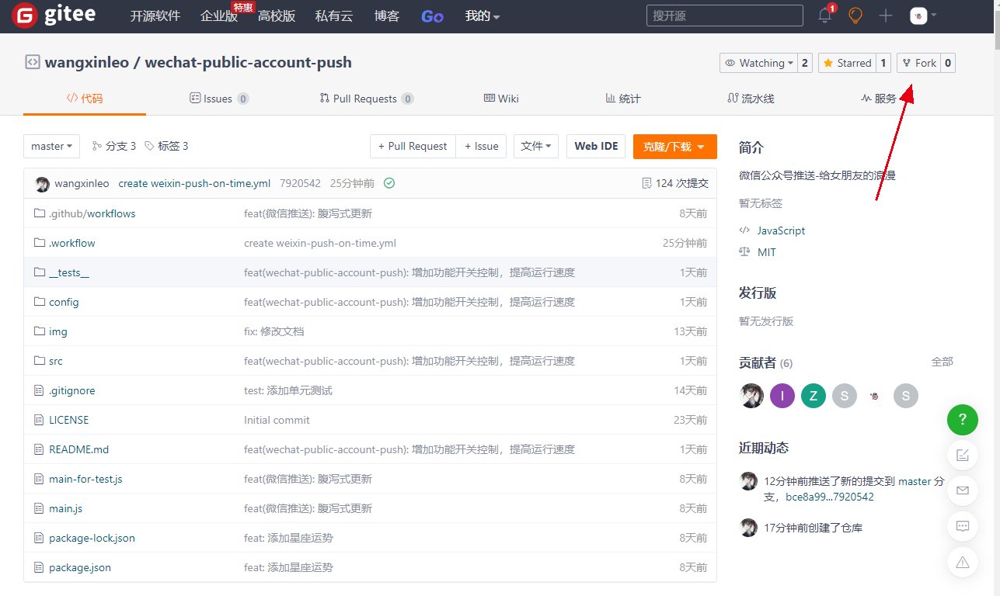

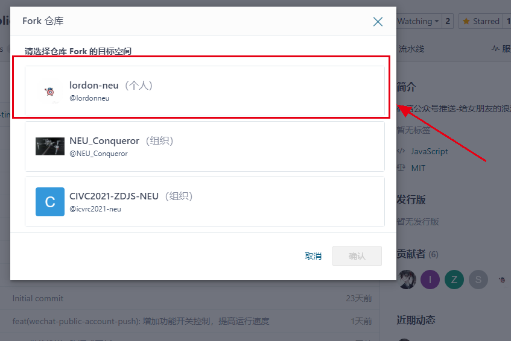

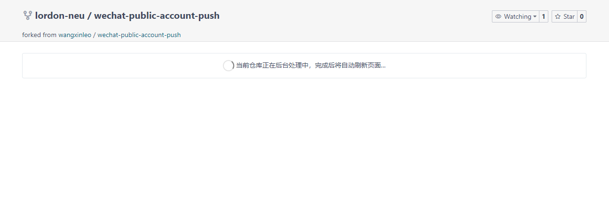

- 保护个人隐私安全，将仓库设为私有

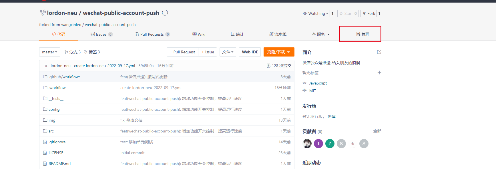

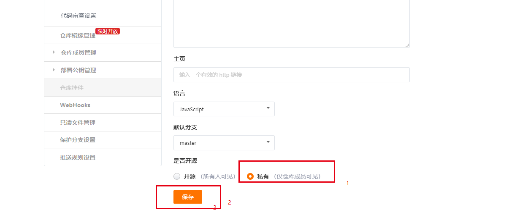

- 修改相应配置

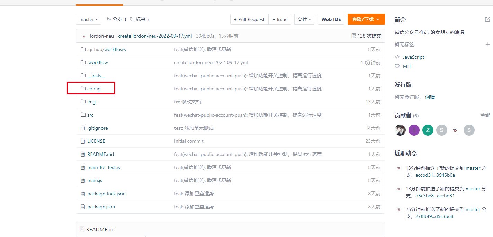

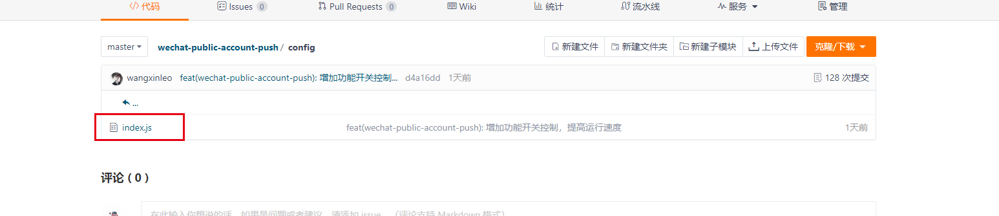

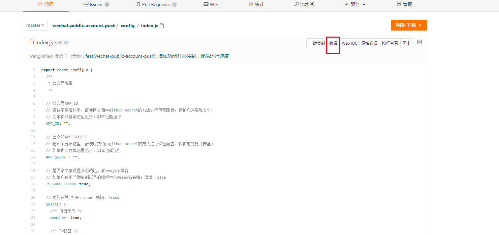

- 按提示填入相应配置后保存

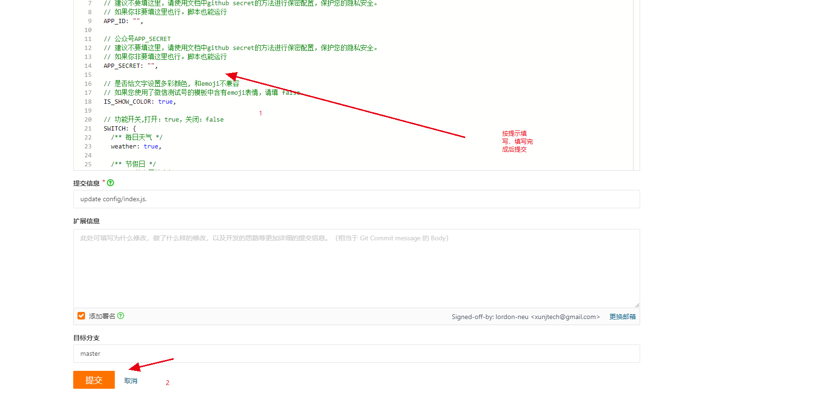

## 2. 在私人仓库中写入自己公众号的信息，启用【流水线】自动任务，定时执行

- 启用【流水线】

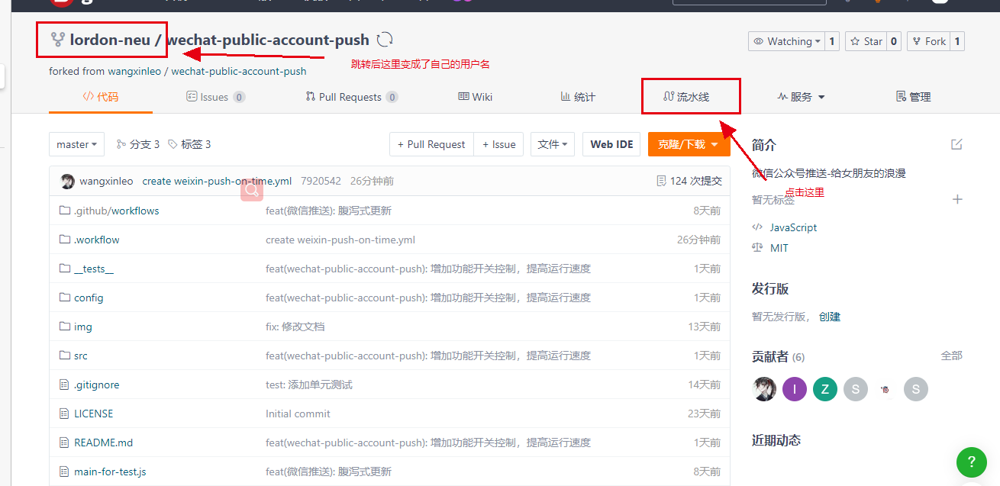

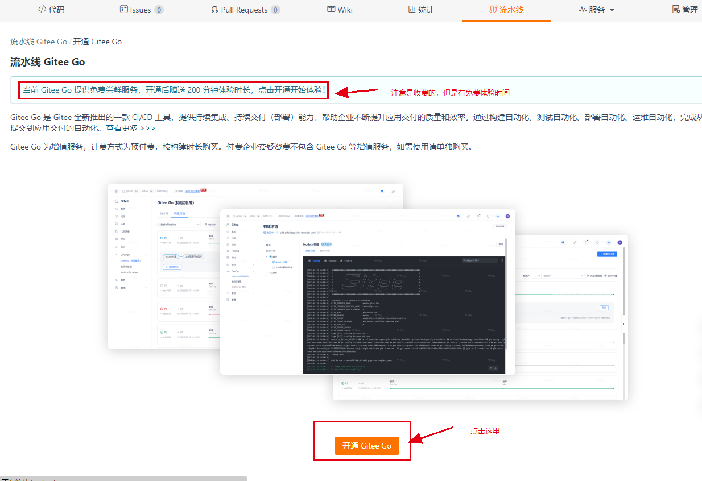

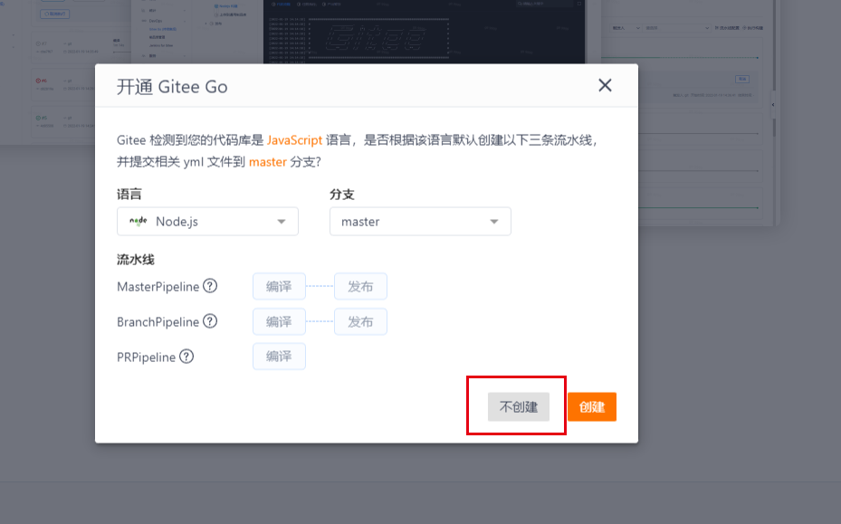


```yaml
version: '1.0'
name: weixin-push-on-time
displayName: weixin-push-on-time
triggers:
  trigger: auto
  push:
  branches:
    prefix:
      - master
  schedule:
    # 以下时间指北京时间8点整
    - cron: '* 0 8 * * ? *'
stages:
  - name: stage-d2bdc7e0
    displayName: 微信推送
    strategy: naturally
    trigger: auto
    executor: [ ]
    steps:
      - step: build@nodejs
        name: build_nodejs
        displayName: Nodejs 构建
        nodeVersion: 16.14.2
        commands:
          - '# 设置NPM源，提升安装速度'
          - npm config set registry https://registry.npmmirror.com
          - ''
          - git checkout master
          - ''
          - npm ci
          - ''
          - '# 执行编译命令'
          - npm run dev
        caches:
          - ~/.npm
          - ~/.yarn
        notify: [ ]
        strategy:
          retry: '0'
```

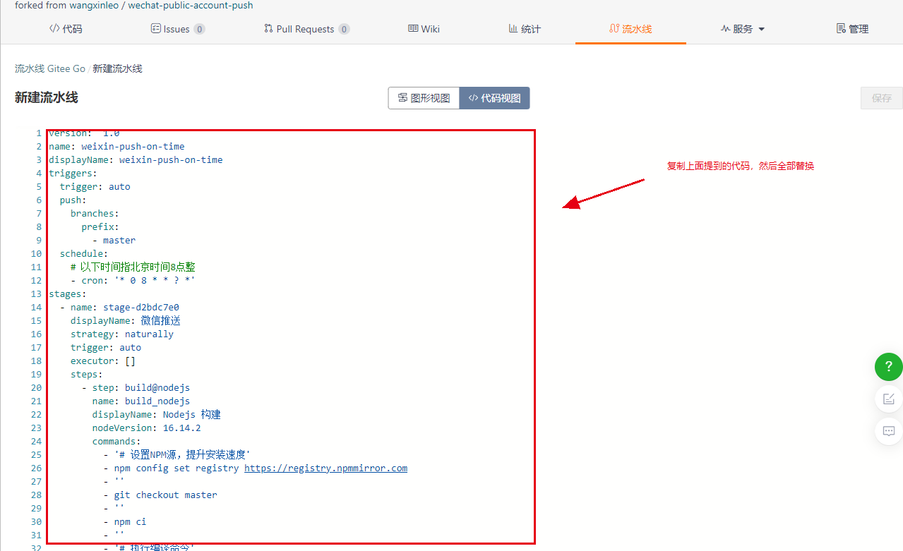

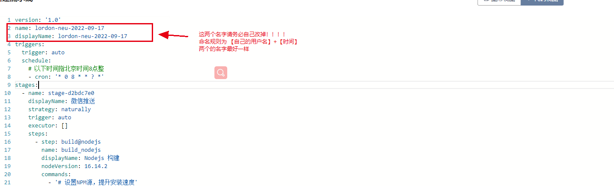

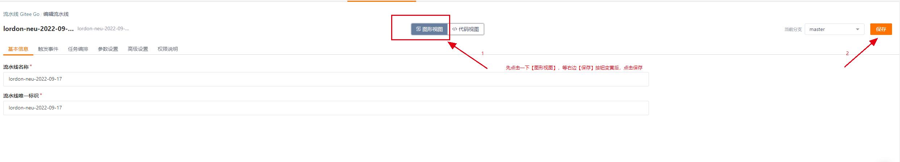

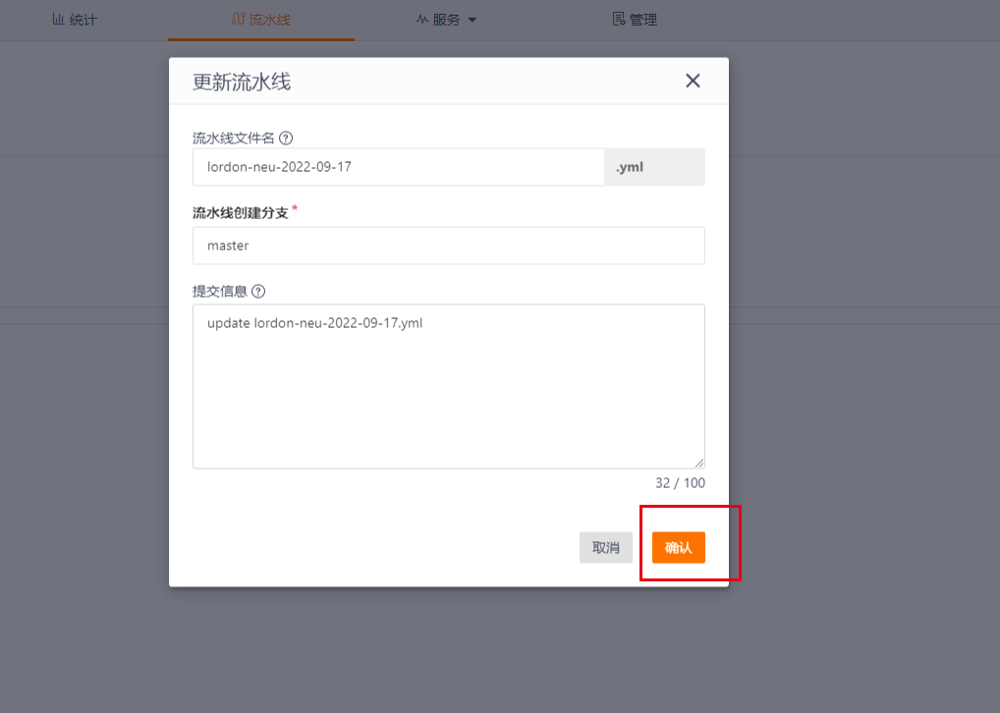

## 3. (选做)：检查脚本是否可以正常执行

- 手动启动脚本

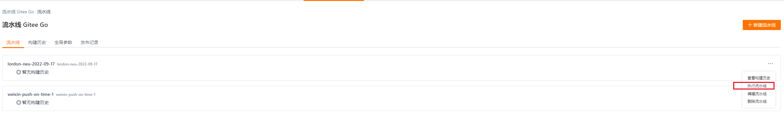

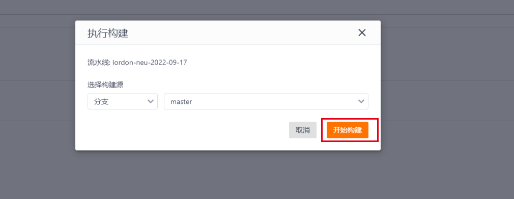

- 查看执行结果

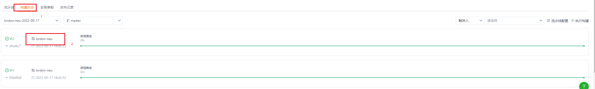

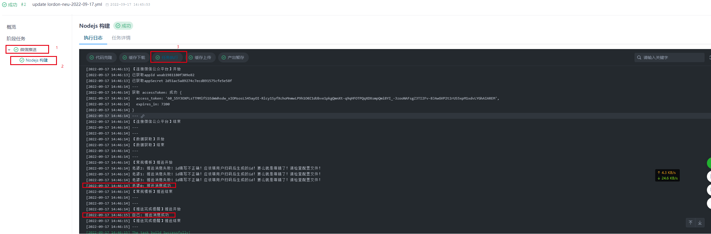

## 4. (选做)：如何更改自动执行时间

[5.2. gitee go如何更改自动执行时间](https://github.com/wangxinleo/wechat-public-account-push#52-gitee-go%E5%A6%82%E4%BD%95%E6%9B%B4%E6%94%B9%E8%87%AA%E5%8A%A8%E6%89%A7%E8%A1%8C%E6%97%B6%E9%97%B4)

[📌返回首页 >>>](../../README.md)
