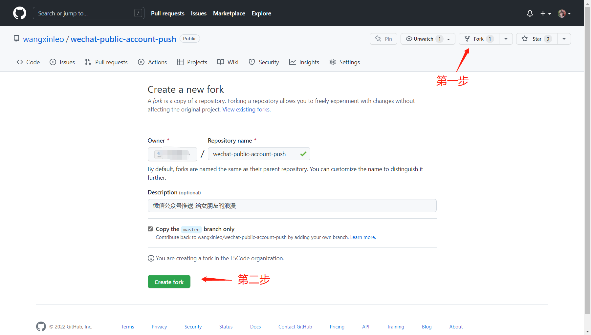
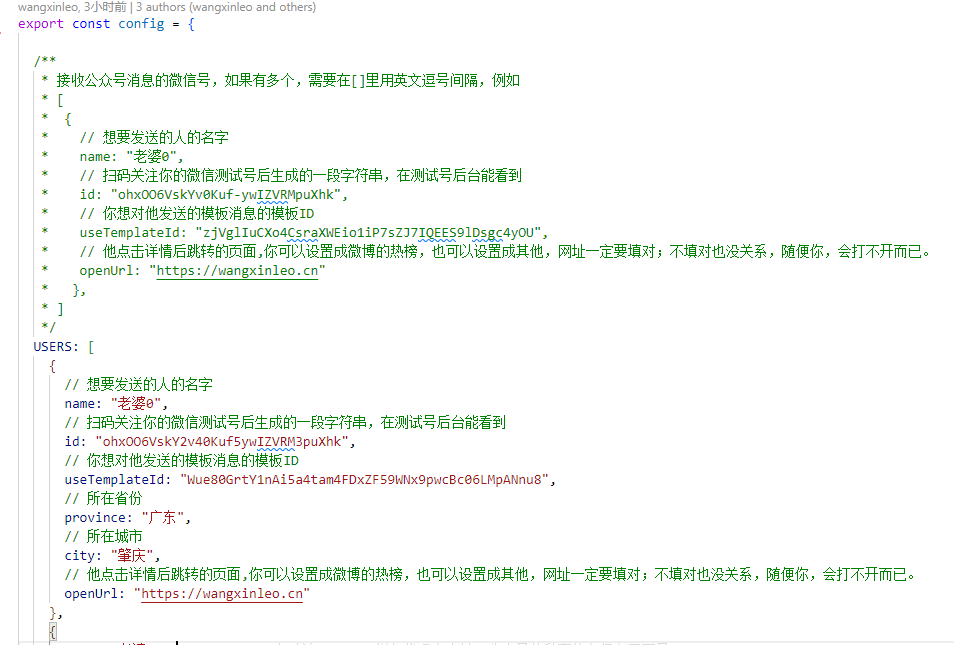

[📌返回首页 >>>](../../README.md)

# Github-Action部署教程

## 1. fork仓库并修改相应配置

- fork仓库 (如果可以当然也希望你可以点一下旁边的小星星)

- 修改相应配置

- 按提示填入相应配置后保存

## 2. 在私人仓库中写入自己公众号的信息，启用workflow自动任务，定时执行

按下图添加两项保密信息`APP_ID` 和 `APP_SECRET`, 可以从测试号后台拿到这两项信息

**这步一定要认真填写，不然程序无法运行！**

- 启用action脚本

## 3. (选做)：检查脚本是否可以正常执行

- 手动启动脚本

- 查看执行结果

## 4. (选做)：如何更改自动执行时间

[5.1. github action如何更改自动执行时间](https://github.com/wangxinleo/wechat-public-account-push#5-githubgitee-%E5%A6%82%E4%BD%95%E6%9B%B4%E6%94%B9%E8%87%AA%E5%8A%A8%E6%89%A7%E8%A1%8C%E6%97%B6%E9%97%B4)

[📌返回首页 >>>](../../README.md)