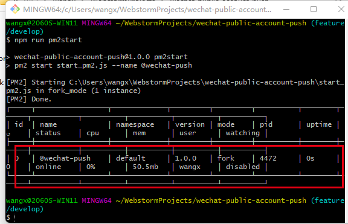
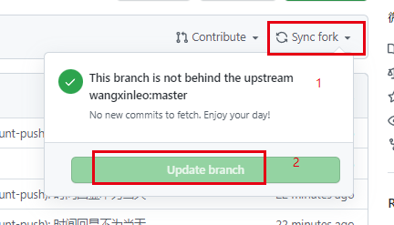
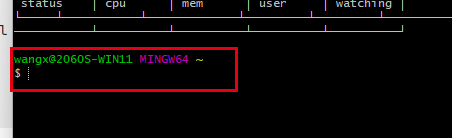
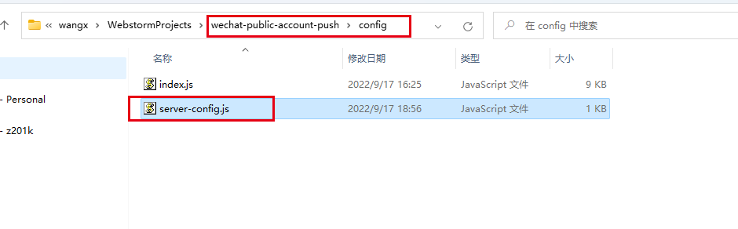

[📌返回首页 >>>](../../README.md)

# 本地或在线服务器部署教程

## Linux 系统

### Ⅰ. **安装运行环境**

- 如果本地已安装 `Nodejs` 和 `git` 环境, 请跳过这一步

如果您使用的是以 Debian 或 Ubuntu 为基础的 服务器系统

```shell

# Using Debian and Ubuntu based distributions
cd ~

curl -fsSL https://deb.nodesource.com/setup_16.x | sudo -E bash -

sudo apt-get install -y nodejs

sudo apt-get install git

```

如果您使用的是 centos 或 其他 服务器系统

```shell

# Using Enterprise Linux based distributions
cd ~

curl -fsSL https://rpm.nodesource.com/setup_16.x | sudo bash -

yum install git

```

### Ⅱ. **下载项目**

```shell

cd ~ && git clone https://github.com/wangxinleo/wechat-public-account-push.git

cd ~/wechat-public-account-push

# 二选一：中国内地执行这一步，速度更快
npm install -g cnpm --registry=https://registry.npm.taobao.org  && cnpm install && cnpm install pm2 -g

# 二选一：国外服务器执行这一步
npm install && npm install pm2 -g

```

### Ⅲ. **填写发送配置**

不会使用vim 命令的可以使用其他命令，或用图形化界面进行修改。

这是你的服务器，只要能改掉文件里的配置就可以了。

```shell

vim ~/wechat-public-account-push/config/index.cjs

```

### Ⅳ. **填写定时配置**
不会使用vim 命令的可以使用其他命令，或用图形化界面进行修改。

这是你的服务器，只要能改掉文件里的配置就可以了。

> 此时间为每天的早上8点，*为匹配任意一个
>
> 这里的时间是中国时间 秒 分 时 日 月 年
>
> 0 0 8 * * *

更详细的规则[点此](https://www.npmjs.com/package/node-schedule)

```shell

vim ~/wechat-public-account-push/config/server-config.js

```

### Ⅴ. **运行**

```shell

cd ~/wechat-public-account-push && npm run pm2start

```

**运行完成效果图**




Ⅵ. **如何停止/重启/删除服务？如何查看运行日志/清空日志？**

```shell
# 停止
pm2 stop @wechat-push 
# 重启
pm2 restart @wechat-push 
# 删除服务
pm2 delete @wechat-push 

# 查看运行日志
pm2 log @wechat-push
# 清空日志
pm2 flush
```

### Ⅶ. **本地服务器版如何更新？**

1. **在github上先 `fork syncing`**



2. **执行以下代码**

```shell
cd ~./wechat-public-account-push && git pull origin master
```

3. **查看配置是否被覆盖，被覆盖则重新填写好配置；**

4. **重启服务**

```shell
pm2 restart @wechat-push 
```


<br/>

## Windows 系统

### Ⅰ. **安装运行环境**

- 如果本地已安装 `Nodejs` 和 `git` 环境, 请跳过这一步

[下载Nodejs16.x安装包](https://nodejs.org/dist/v16.17.0/node-v16.17.0-x64.msi)

[下载git安装包](https://github.com/git-for-windows/git/releases/download/v2.37.3.windows.1/Git-2.37.3-64-bit.exe)

安装说明：**无它，一路next**

### Ⅱ. **下载项目**

在你的电脑里随便一个盘选择任意一个文件夹（最好自己创建，自己要知道在哪里）

进入到文件夹后，右键当前文件夹的空白处 --> 【Git Base Here】

(win11 则点开【显示更多选项】即可看到 【Git Base Here】)


执行以下命令

```shell

git clone https://github.com/wangxinleo/wechat-public-account-push.git

cd ./wechat-public-account-push

# 二选一：中国内地执行这一步，速度更快
npm install -g cnpm --registry=https://registry.npm.taobao.org && cnpm install && cnpm install pm2 -g

# 二选一：国外服务器执行这一步
npm install && npm install pm2 -g

```

当黑窗口回到光标闪烁状态时即完成。



### Ⅲ. **填写发送配置**

如果上一步执行成功了，你当前文件夹里面肯定会出现 `wechat-public-account-push` 文件夹


到 `wechat-public-account-push/config/index.cjs` 中修改配置。


如果显示无法打开，选中该文件 --> 右键 --> 打开方式 --> 记事本


按照提示修改配置

### Ⅳ. **填写定时配置**
到 `wechat-public-account-push/config/server-config.js` 中修改配置。



> 此时间为每天的早上8点，*为匹配任意一个
>
> 这里的时间是中国时间 秒 分 时 日 月 年
>
> 0 0 8 * * *

### Ⅴ. **运行**

在 `wechat-public-account-push` 文件夹中，右键 --> 【Git Base Here】


执行以下命令

```shell

npm run pm2start

```

**运行完成效果图**


### Ⅵ. **如何停止/重启/删除服务？如何查看运行日志/清空日志？**

```shell
# 停止
pm2 stop @wechat-push 
# 重启
pm2 restart @wechat-push 
# 删除服务
pm2 delete @wechat-push 

# 查看运行日志
pm2 log @wechat-push
# 清空日志
pm2 flush
```

### Ⅶ. **本地服务器版如何更新？**

1. **在github上先 `fork syncing`**


2. **执行以下代码**

```shell
cd ~./wechat-public-account-push && git pull origin master
```

3. **查看配置是否被覆盖，被覆盖则重新填写好配置；**

4. **重启服务**

```shell
pm2 restart @wechat-push 
```

[📌返回首页 >>>](../../README.md)