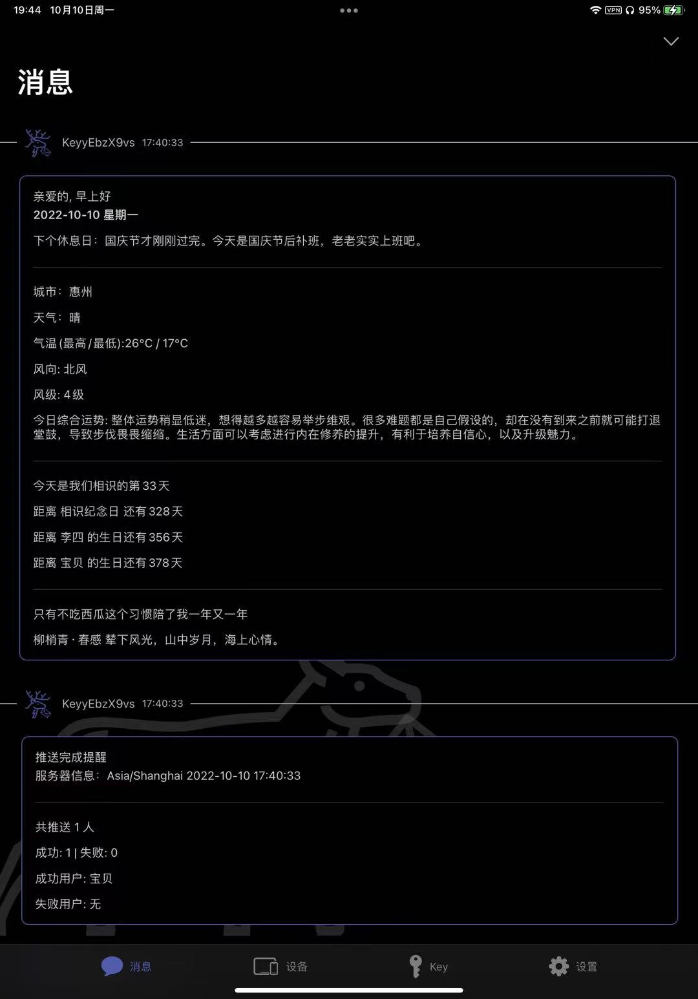
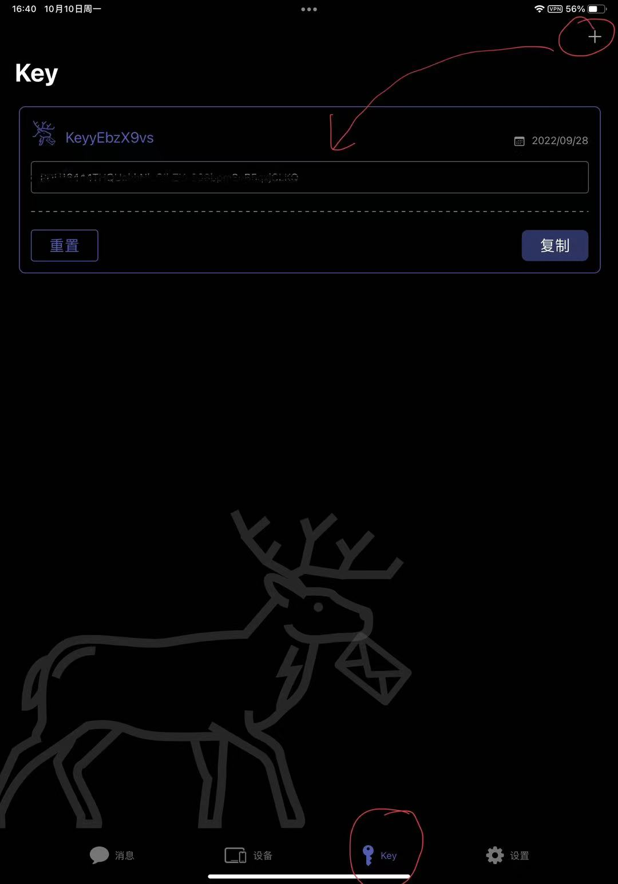
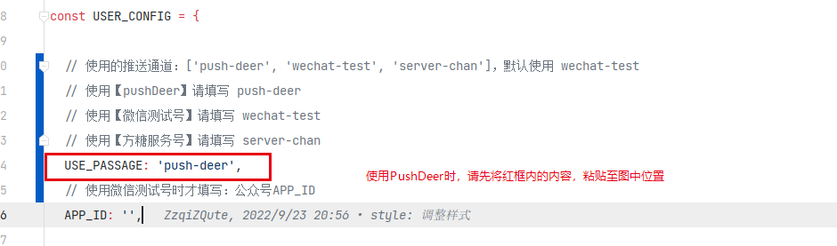

[📌返回首页 >>>](../../README.md)

# 使用PushDeer

运行图示：



## Ⅰ. 扫描以下二维码或使用APP

**iOS14+**


苹果手机（iOS 14+）用系统摄像头扫描上边的码即可拉起轻应用。

也可以在苹果商店搜索「PushDeer」安装。

**iOS14-**

在苹果商店搜索「PushDeer」安装。

**MacOS 11+**

可在Mac应用商店中搜索「PushDeer」安装。

**Android**

快应用尚在开发

可下载并安装Android测试版APP

[~~下载APK > pushdeer-beta-v01.apk~~]()

> 9月22日消息：受小米推送新协议影响，目前Android版的推送已不可用，只能等待之后的MQTT版本了。

## Ⅱ. 配置PushDeer

### 1. 通过apple账号（或微信账号·仅Android版支持）登录
   

### 2. 切换到「设备」标签页，点击右上角的加号，注册当前设备
   

### 3. 切换到「Key」标签页，点击右上角的加号，创建一个Key
   

### 4. 保存好 Key ，等会儿在第二步中需要用到


## Ⅲ. 进行模板配置

### 仓库`config/template-config.cjs` 已内置两个模板，可以根据个人需求进行相应修改

> 模板中{{***.DATA}}都对应相应的数据，需要就保留，不需要就删掉


## Ⅳ. 进行基础config配置

### 打开仓库中`config/index.cjs`的进行，进行编辑


### 1. 使用pushdeer模式
   ```javascript
   // 请将以下代码按照图示粘贴到对应位置
   USE_PASSAGE: 'push-deer',
   ```
   

### 2. KEY填到哪里?

   

### 2. Ⅲ. 中的模板id填到哪里?

   


**以上步骤完成后请返回首页继续进行后续操作**

[📌返回首页 >>>](../../README.md)