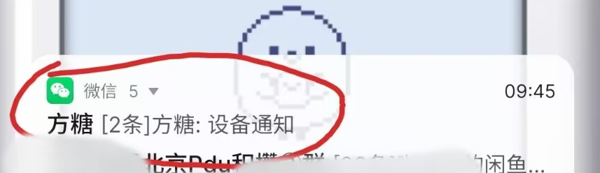
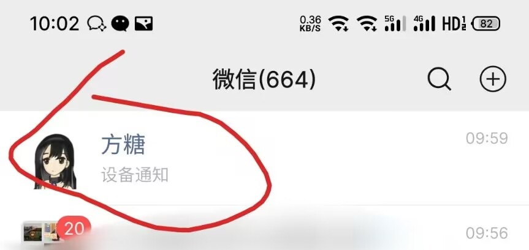
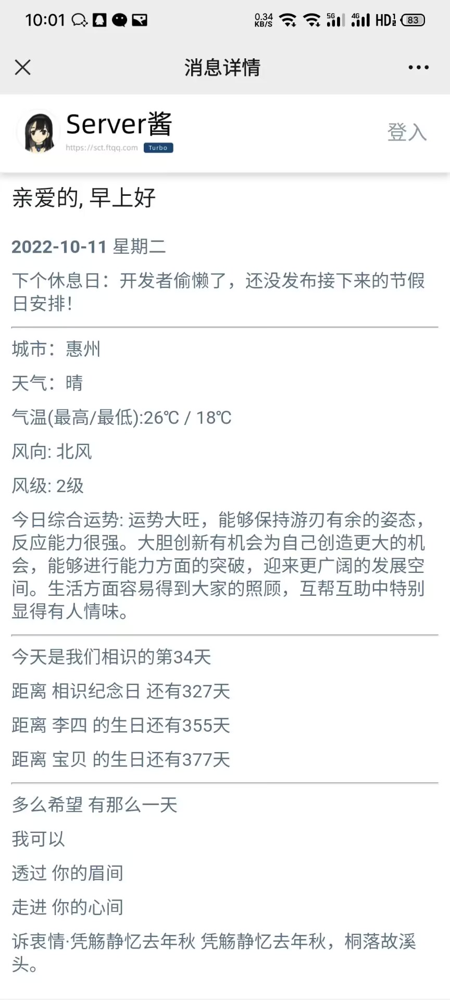
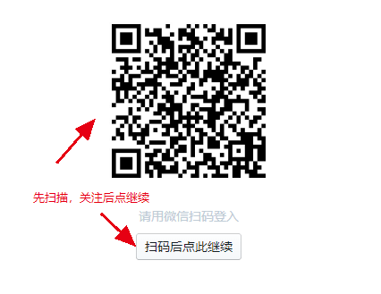
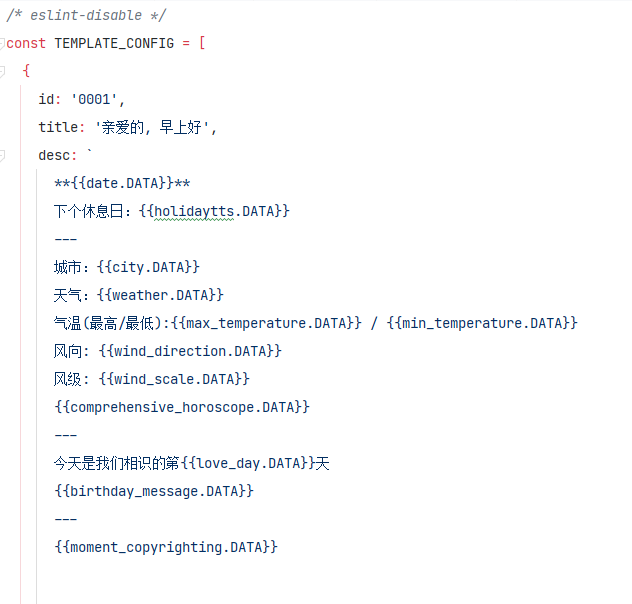
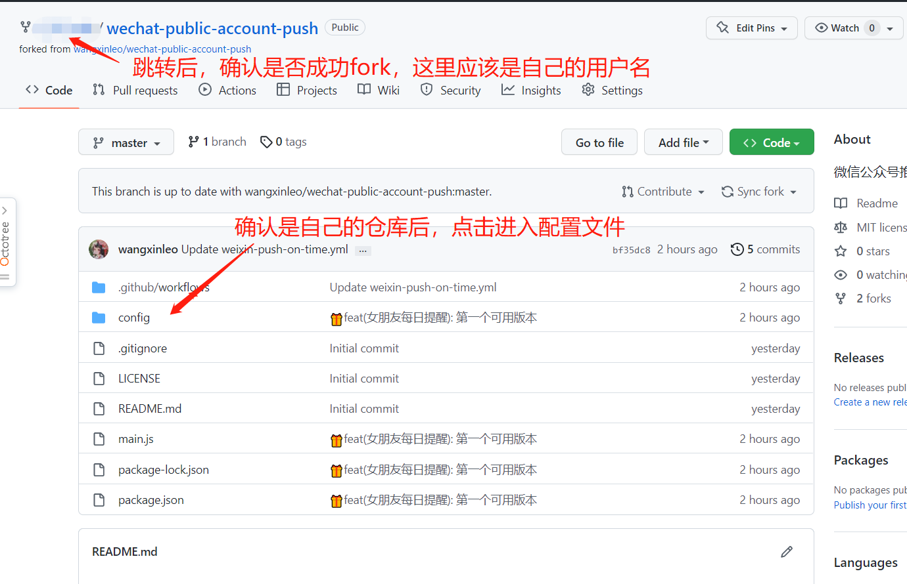
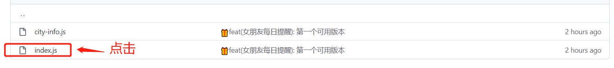
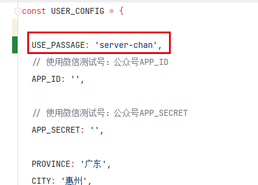
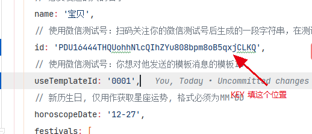
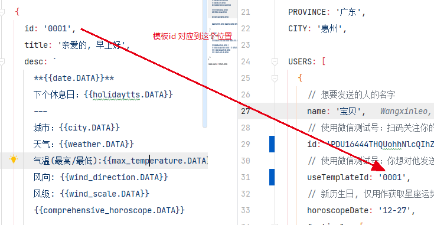

[📌返回首页 >>>](../../README.md)

# 使用PushDeer

运行图示：








## Ⅰ. 注册并使用server-chan服务

- 浏览器打开并登录 [server-chan首页](https://sct.ftqq.com/login)

  

- 复制SendKey保存备用

  

## Ⅱ. 进行模板配置

仓库`config/template-config.cjs` 已内置两个模板，可以根据个人需求进行相应修改

> 模板中{{***.DATA}}都对应相应的数据，需要就保留，不需要就删掉



## Ⅲ. 进行基础config配置

### 打开仓库中`config/index.cjs`的进行，进行编辑






### 1. 使用server-chan模式
   ```javascript
   // 请将以下代码按照图示粘贴到对应位置
   USE_PASSAGE: 'server-chan',
   ```
   

### 2. KEY填到哪里?

   

### 3. Ⅲ. 中的模板id填到哪里?

   


**以上步骤完成后请返回首页继续进行后续操作**

[📌返回首页 >>>](../../README.md)