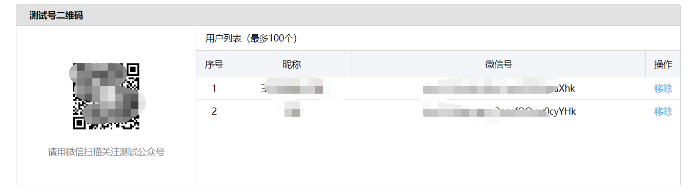
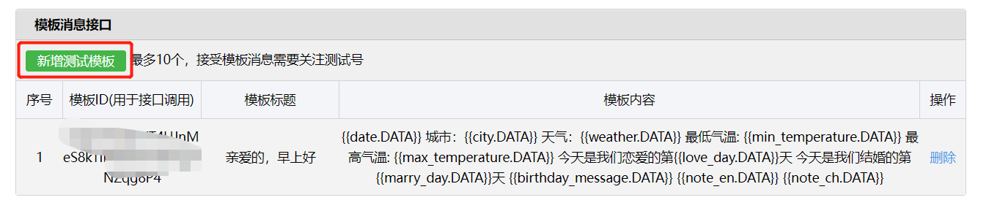

[🪃返回首页 >>>](../README.md)

# 使用微信测试号

## Ⅰ. 注册一个微信公众测试号

- 浏览器打开并登录 [微信公众测试号](https://mp.weixin.qq.com/debug/cgi-bin/sandbox?t=sandbox/login)

- 登录成功后, 就可以生成微信公众测试号的appID和appsecret这两串数字, 记下备用


- 扫描测试号二维码关注测试号, 扫描之后, 右边就会出现相应的已关注人员id, 记下备用



## Ⅱ. 进行模板配置

新增测试模板, 点击 `新增测试模板` , 进行以下设置


> 这里面的每一个{{***.DATA}}都对应相应的数据，需要就保留，不需要就删掉


模板标题: 自定义，例如: `亲爱的，早上好!`

模板内容:

```
{{date.DATA}}  
城市：{{city.DATA}}  
天气：{{weather.DATA}}  
最低气温: {{min_temperature.DATA}}  
最高气温: {{max_temperature.DATA}}  
今天是我们恋爱的第{{love_day.DATA}}天
今天是我们结婚的第{{marry_day.DATA}}天

{{birthday_message.DATA}}

{{one_talk.DATA}} -- {{talk_from.DATA}}

{{note_en.DATA}}  
{{note_ch.DATA}}
```

模板标题: `推送完成提醒`

模板内容:

```
服务器信息：{{post_time_zone.DATA}} {{post_time.DATA}}

共推送 {{need_post_num.DATA}}  人
成功: {{success_post_num.DATA}} | 失败: {{fail_post_num.DATA}}
成功用户: {{success_post_ids.DATA}}
失败用户: {{fail_post_ids.DATA}}
```

记下模板代码


