[📌返回首页 >>>](../../README.md)

### 新手推荐微信测试号其他方式请回首页继续阅读
**[✨如GitHub图片不显示可点击前往知乎查看](https://zhuanlan.zhihu.com/p/628390371?)**

**注**：使用的默认参数和接口，需要配置天行 `api` 参数请返回首页查阅资料

##### 一. fork代码我放在后面和微信测试号参数一起配置

##### 二. 准备微信测试号

1. ###### 注册微信测试号[>>>点击注册配置](../message-channel/test-number.md)

   * 浏览器打开并登录 [微信公众测试号](https://mp.weixin.qq.com/debug/cgi-bin/sandbox?t=sandbox/login)
   * 登录成功后, 就可以生成微信公众测试号的**appID**和**appsecret**这两个字符串, 记下备用

   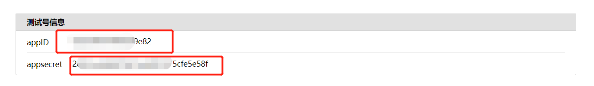

   * 扫描测试号二维码关注测试号, 扫描之后, 右边就会出现相应的**已关注人员id**, 记下备用

   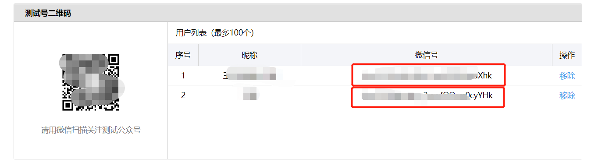

2. ###### 模板配置

   + 新增模板

   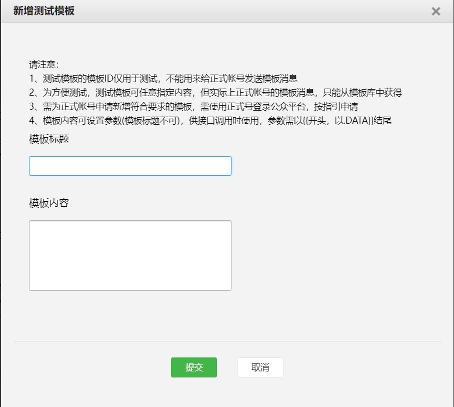

   + 新增测试模板, 点击 `新增测试模板` , 进行以下设置

     > 这里面的每一个{{***.DATA}}都对应相应的数据，需要就保留，不需要就删掉

     + **需要推送的模板**

     模板标题: 自定义，例如: `亲爱的，早上好!`

     **注：**

     1. `{{xxxx.Data}}`前面必须加占位符（emoji也行），否则不仅当前行不显示，可能后面的几行也不显示
     2. emoji仍然部分支持，有些emoji表情不支持，需要重新挑选支持的emoji，可以前往 [https://emojipedia.org](https://emojipedia.org/) 挑选并逐个测试
     3. 长文本要使用\r 换行显示，腾讯加了字数限制一行超过20字会显示...
     4. 颜色被腾讯下架了

     示例

     ```js
     🗓️{{date.DATA}}
     城市：{{city.DATA}}
     天气☁️：{{weather.DATA}}
     温度🌡️: {{min_temperature.DATA}}--{{max_temperature.DATA}}
     风向：{{wind_direction.DATA}}
     风级：{{wind_scale.DATA}}
     温馨提示：{{notice.DATA}}
     值得纪念：{{birthday_message.DATA}}
     💗：{{earthy_love_words.DATA}}
     每日一句😋
     中文：{{note_ch.DATA}}
     English：{{note_en.DATA}}
     和{{poetry_author.DATA}}约个会：{{poetry_content.DATA}}
     ```

     效果

     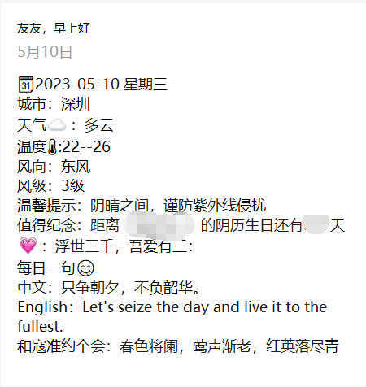

     + **是否推送成功模板**

       模板标题: `推送完成提醒`

       模板内容:

       ```js
       服务器信息：{{post_time_zone.DATA}} {{post_time.DATA}}
       
       共推送 {{need_post_num.DATA}} 人
       成功: {{success_post_num.DATA}} | 失败: {{fail_post_num.DATA}}
       成功用户: {{success_post_ids.DATA}}
       失败用户: {{fail_post_ids.DATA}}
       ```

​      效果：

​        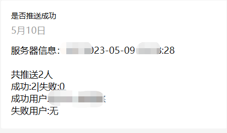

​        以上只是推荐模板，更多好玩的模板建议自己根据需求前往公众号模板参数说明
       [参数详情在主页2.0 >>>](../../README.md)
3. ###### 记录模板id

   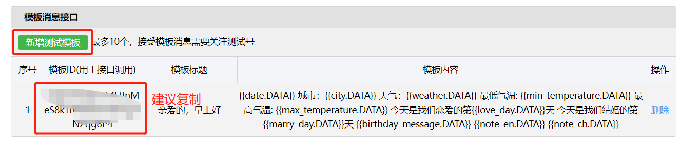

##### 

###  Github-Action部署教程

#### 1. fork仓库并修改相应配置

- fork仓库 (如果可以当然也希望你可以点一下旁边的小星星)

**自动配置参数插件** 
[✨配置自动生成 传送门 >>>](https://shuangxunian.github.io/wechat-form/)

[❓配置自动生成 教程 >>>](https://github.com/shuangxunian/wechat-form)

**手动配置参数** 


- 修改相应配置


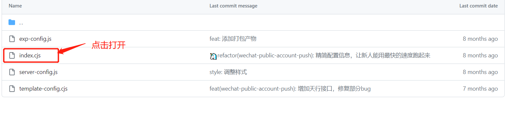


- 按提示填入相应配置后保存
- 红框位置，注意符号，注意格式，生日和纪念日可以自行选择填写，不要的信息可以注释和删除

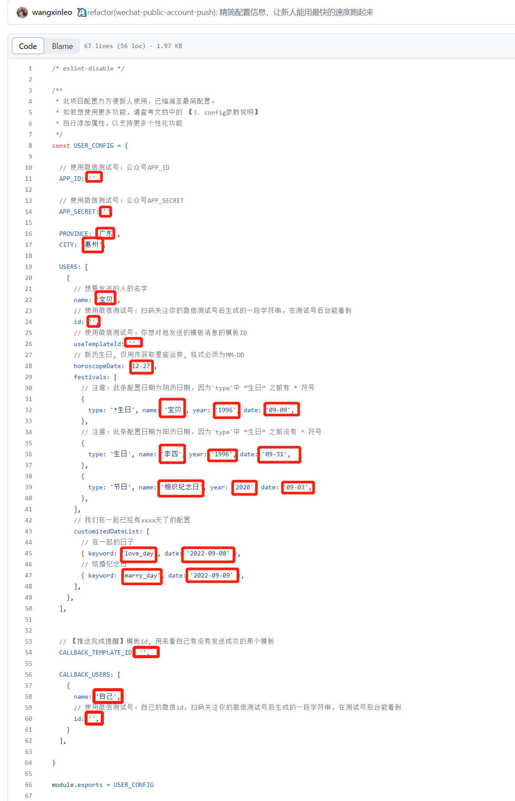

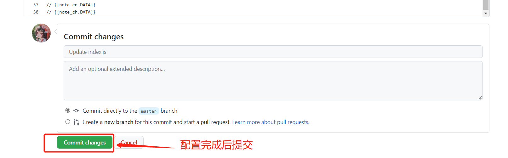

## 2. 在私人仓库中写入自己公众号的信息，启用workflow自动任务，定时执行

按下图添加两项保密信息`APP_ID` 和 `APP_SECRET`, 可以从测试号后台拿到这两项信息

**这步一定要认真填写，不然程序无法运行！**


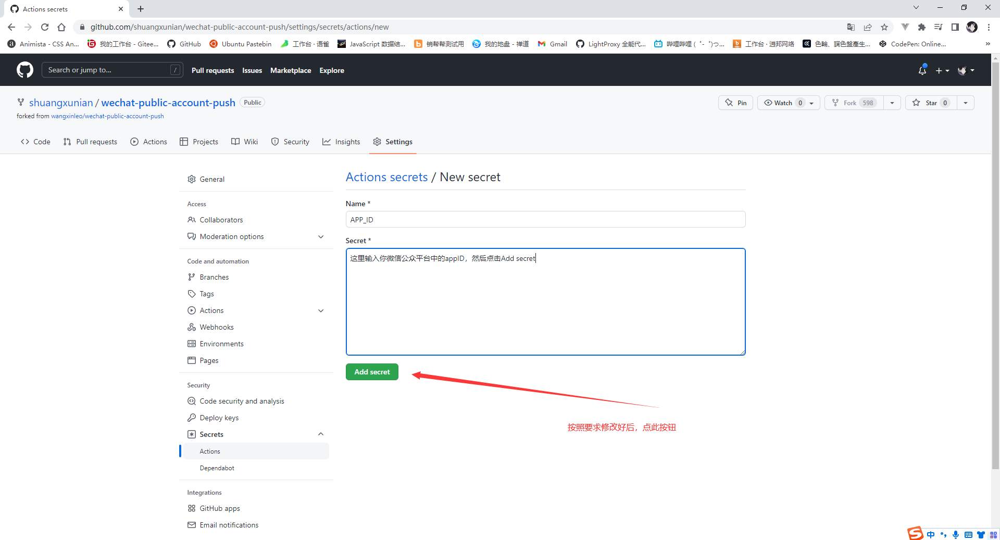


- 启用action脚本

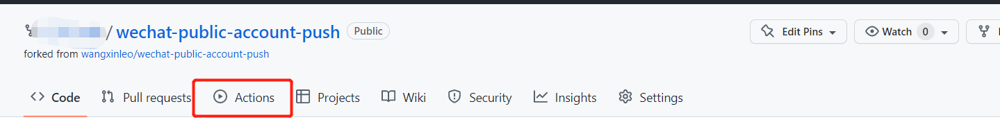


## 3. (选做)：检查脚本是否可以正常执行

- 手动启动脚本

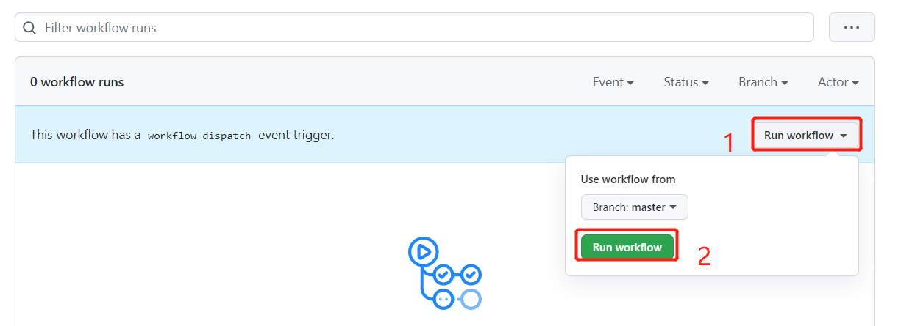

- 查看执行结果


[github action如何更改自动执行时间首页6.1,默认是7点开始排队](https://github.com/wangxinleo/wechat-public-account-push#5-githubgitee-%E5%A6%82%E4%BD%95%E6%9B%B4%E6%94%B9%E8%87%AA%E5%8A%A8%E6%89%A7%E8%A1%8C%E6%97%B6%E9%97%B4)


[📌返回首页 >>>](../../README.md)
